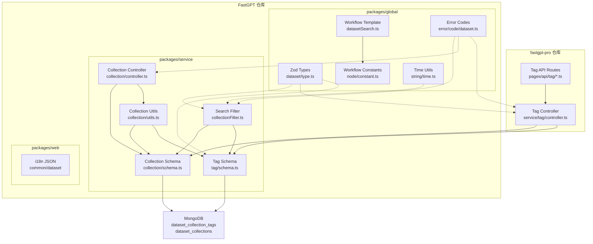
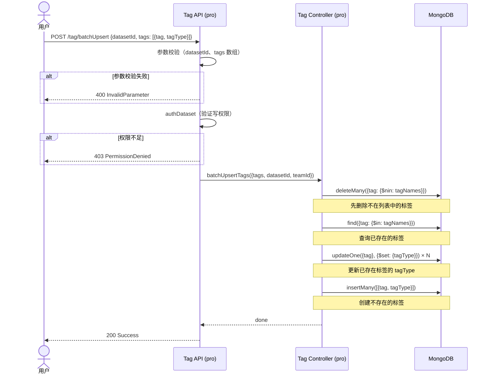
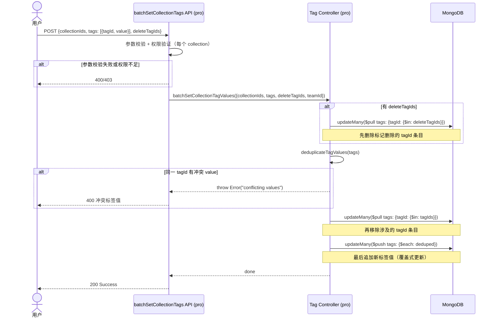
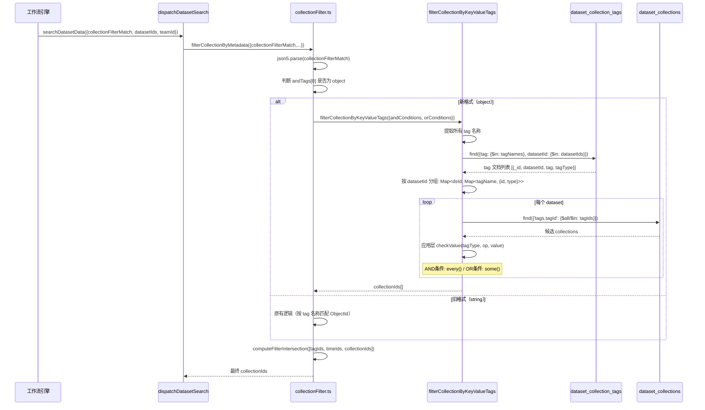
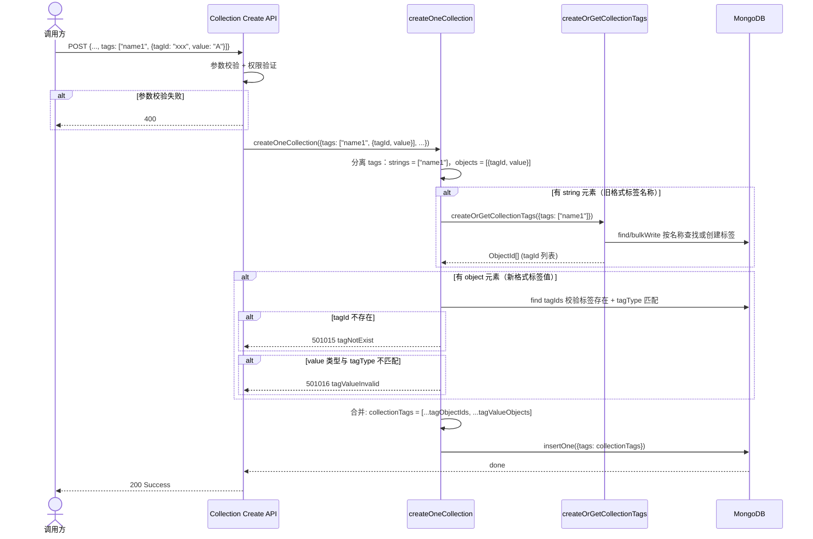

# 知识库标签过滤功能 — 模块概要设计文档（轻量）

**文档版本：** V1.1
**创建日期：** 2026-07-27
**更新日期：** 2026-07-29
**来源需求：** `doc/requirement/requirement.md`
**代码仓库：** FastGPT（主仓库）+ fastgpt-pro（Pro API 仓库）
**设计范围：** 本次仅填写内部设计（ch04）和数据库设计，其他章节标注"不涉及"。**本次迭代仅处理后端代码 + i18n，前端 UI 组件不动。**

---

## 模块职责和边界

### 模块职责

本模块为 FastGPT 知识库标签系统增加**类型化标签**和**标签值过滤**能力：

1. **标签类型扩展**：`dataset_collection_tags` 新增 `tagType` 字段，支持 `string`/`number`/`datetime` 三种类型
2. **Collection 标签值**：`dataset_collections.tags` 从 `string[]` 扩展为 `(string | { tagId, value })[]` 混合格式
3. **标签管理 API**（fastgpt-pro）：batchUpsert、setCollectionTags、batchSetCollectionTags
4. **检索过滤增强**：知识检索节点支持按标签类型+操作符过滤（`$eq`、`$gt`、`$contains` 等）
5. **Agent V2 搜索支持**：Agent V2（Workflow Agent）应用的知识库搜索支持标签过滤

### 模块边界

| 边界 | 说明 |
|------|------|
| 上游 | 前端 UI（标签管理面板、知识检索节点配置）—— **本次不动前端 UI 组件**，i18n 文案需同步更新 |
| 下游 | MongoDB（dataset_collection_tags、dataset_collections） |
| 依赖服务 | fastgpt-pro（标签管理 API 层） |
| 所属仓库 | 标签管理 API → fastgpt-pro；数据模型 + 搜索过滤 → FastGPT |

---

## 对外接口

### 标签管理 API（fastgpt-pro，Base: `/proApi/core/dataset/tag`）

| 接口 | 方法 | 说明 | 变更类型 |
|------|------|------|----------|
| `/create` | POST | 创建单个标签 | **修改**：新增 `tagType` 可选参数（枚举：string/number/datetime，默认 string） |
| `/update` | POST | 更新标签名称 | **修改**：新增 `tagType` 可选参数（不传则保持原类型） |
| `/batchUpsert` | POST | 批量 upsert 标签（先删除不在列表中的，再更新/新建） | **新增** |
| `/setCollectionTags` | POST | 设置单个 collection 的标签值 | **新增** |
| `/batchSetCollectionTags` | POST | 批量设置多个 collection 的标签值（含 deleteTagIds 删除标记） | **新增** |

以下接口不变，仅列出供参考：

| 接口 | 方法 | 说明 |
|------|------|------|
| `/delete` | DELETE | 删除标签 |
| `/list` | POST | 分页查询标签列表（支持模糊搜索） |
| `/getAllTags` | GET | 获取知识库所有标签（无分页，按 `_id` 倒序） |
| `/usage` | GET | 查询标签使用情况（每个标签被哪些 collection 引用） |
| `/addToCollections` | POST | 按差分方式增删 collection 上的标签（已废弃，仅保留兼容） |

### 知识库搜索过滤（FastGPT 仓库）

| 接口/函数 | 说明 | 变更类型 |
|-----------|------|----------|
| `filterCollectionByMetadata` | collection 过滤入口 | **修改**：新增新旧格式路由判断 |
| `filterCollectionByKeyValueTags` | 新格式标签过滤函数 | **新增** |
| `checkValue` | 类型感知的标签值比较 | **新增** |
| `dispatchAgentDatasetSearch` (internal) | Agent 知识库搜索分发 | **修改**：`searchData` 新增 `collectionFilterMatch` 字段 |
| `getAgentDatasetParams` (internal) | Agent 搜索参数重组（降级路径） | **修改**：补全 `collectionFilterMatch` 映射 |

以下接口不变，仅列供参考：

| 接口/函数 | 说明 |
|-----------|------|
| `POST /api/core/dataset/searchTest` | 知识库搜索测试（`collectionFilterMatch` 参数不变，新格式由内部解析层自动识别） |
| `dispatchDatasetSearch` (internal) | 工作流 datasetSearch 节点分发 |

### Collection 创建 API（FastGPT 仓库）

`tags` 参数扩展为混合格式：`(string | { tagId, value })[]`。string 元素走现有 `createOrGetCollectionTags` 解析为 ObjectId，object 元素直接作为新格式标签值写入。

| 接口/函数 | 说明 | 变更类型 |
|-----------|------|----------|
| `createOneCollection` | collection 创建核心函数 | **修改**：`tags` 入参类型从 `string[]` 扩展为 `(string \| { tagId, value })[]` |
| `createOrGetCollectionTags` | 标签名称 → ObjectId 解析 | 不变（仅处理 string 元素，object 元素直接透传） |
| `POST /core/dataset/collection/create/file` | 文件上传创建 collection | **修改**：`tags` 支持混合格式 |
| `POST /core/dataset/collection/create/link` | 网页链接导入创建 collection | **修改**：`tags` 支持混合格式 |
| `POST /core/dataset/collection/create/text` | 手动录入创建 collection | **修改**：`tags` 支持混合格式 |
| `POST /core/dataset/collection/create/apiCollection` | API 导入创建 collection | **修改**：`tags` 支持混合格式 |
| `POST /core/dataset/collection/create/images` | 图片导入创建 collection | **修改**：`tags` 支持混合格式（原不支持 tags） |
| `POST /core/dataset/collection/create/backup` | 备份 CSV 导入创建 collection | **修改**：`tags` 支持混合格式（原不支持 tags） |
| `POST /core/dataset/collection/create/template` | 模板 CSV 导入创建 collection | **修改**：`tags` 支持混合格式（原不支持 tags） |

> 完整 OpenAPI 规格（请求/响应结构、错误码）见 `doc/design/API_design.md`。

---

## 内部设计

### 4.1 子模块划分

#### 4.1.1 子模块清单

| 子模块 | 职责 | 主要文件 | 代码位置 |
|--------|------|---------|---------|
| Tag Schema (MongoDB) | 标签存储模型，新增 tagType 字段 | `tag/schema.ts` | `packages/service/core/dataset/` |
| Collection Schema (MongoDB) | Collection 存储模型，tags 混合格式 + 新增索引 `{ teamId: 1, datasetId: 1, 'tags.tagId': 1 }` | `collection/schema.ts` | `packages/service/core/dataset/` |
| Collection Utils | 标签创建/转换逻辑，支持新旧格式混合 | `collection/utils.ts` | `packages/service/core/dataset/` |
| Collection Controller | createOneCollection 扩展支持传入标签值 | `collection/controller.ts` | `packages/service/core/dataset/` |
| Tag Controller (pro) | 标签管理业务逻辑（batchUpsert/setCollectionTags 等） | `tag/controller.ts` | `projects/app/src/service/core/dataset/` (fastgpt-pro) |
| Tag API Routes (pro) | 标签管理 HTTP 入口 | `tag/*.ts` | `projects/app/src/pages/api/core/dataset/` (fastgpt-pro) |
| Search Filter | 搜索过滤逻辑，新增新格式过滤函数 | `defaultRecall/collectionFilter.ts` | `packages/service/core/dataset/search/` |
| Zod Types | 全局类型定义（tagType、CollectionTagValueType） | `dataset/type.ts` | `packages/global/core/` |
| Workflow Constants | 工作流节点输入类型枚举（tagFilterConfig、off） | `workflow/node/constant.ts` | `packages/global/core/` |
| Workflow Template | 知识检索节点模板（collectionFilterMatch 渲染类型） | `template/system/datasetSearch.ts` | `packages/global/core/workflow/` |
| Time Utils | UTC 时间转换工具函数 | `common/string/time.ts` | `packages/global/` |
| Error Codes | 标签相关错误码 | `error/code/dataset.ts` | `packages/global/common/` |
| OpenAPI Tag Schemas | 标签管理 API 的 Zod Schema 定义（tagType、CollectionTagValueType 等） | `openapi/core/dataset/apiDataset/` | `packages/global/`（新增文件） |
| OpenAPI Collection Schemas | 更新 collection 相关 API 的 tags 字段类型 | `openapi/core/dataset/collection/createApi.ts`, `api.ts` | `packages/global/`（修改） |
| i18n | 新增标签错误提示及交互文案翻译（zh-CN/en/zh-Hant） | `web/i18n/*/common.json`, `web/i18n/*/dataset.json` | `packages/` |

> **注意**：前端 UI 组件（TagFilterConfig、NodeInputSelect）本次不动，不在变更范围内。

#### 4.1.2 子模块依赖关系



### 4.2 对软件总体架构的影响

| 分类 | 是否影响 | 说明 |
|------|---------|------|
| 总体架构影响 | 否 | 变更限于知识库标签子系统内部，不改变系统架构分层 |
| 影响子模块 < 3 个 | 否 | 涉及多个子模块但均为标签系统内部扩展 |
| 需重做总体设计 | 否 | 无架构级变更 |

### 4.3 流程设计

#### 4.3.1 流程1：批量 Upsert 标签

**流程描述：** 用户通过标签管理面板批量编辑标签后保存，系统自动增/删/改标签。



| 步骤 | 描述 | 内部/外部 | 涉及函数 | 异常处理 |
|------|------|----------|---------|---------|
| 1 | 参数校验 | [内部] | API handler | 400 InvalidParameter |
| 2 | 权限验证 | [内部] | `authDataset` | 403 PermissionDenied |
| 3 | 删除不在列表中的标签 | [内部] | `deleteMany` | MongoDB 错误 → 500 |
| 4 | 查询已存在标签 | [内部] | `find` | MongoDB 错误 → 500 |
| 5 | 更新已存在标签的 tagType | [内部] | `updateOne` × N | 单条失败不影响其他 |
| 6 | 批量创建新标签 | [内部] | `insertMany` | 重复 tag 名 → 报错（501013 tagNameDuplicate） |

#### 4.3.2 流程2：批量设置 Collection 标签值

**流程描述：** 用户选择多个 collection，设置/修改/删除标签值。



| 步骤 | 描述 | 内部/外部 | 涉及函数 | 异常处理 |
|------|------|----------|---------|---------|
| 1 | 参数校验 + 权限验证 | [内部] | `authDatasetCollection` | 400/403 |
| 2 | 先删除标记删除的 tagId 条目 | [内部] | `$pull` updateMany | 无匹配 collection → 不报错 |
| 3 | 去重 + 冲突检测 | [内部] | `deduplicateTagValues` | 冲突 → throw Error |
| 4 | 移除旧标签值 | [内部] | `$pull` updateMany | MongoDB 错误 → 500 |
| 5 | 追加新标签值 | [内部] | `$push` updateMany | MongoDB 错误 → 500 |

**执行顺序保证**：先删除标记删除的 → 再覆盖匹配 tagId 的条目（不匹配的 tagId 不受影响）。

#### 4.3.3 流程3：知识检索标签过滤（新格式）

**流程描述：** 知识检索节点的 `collectionFilterMatch` 支持新格式标签过滤。



| 步骤 | 描述 | 内部/外部 | 涉及函数 | 异常处理 |
|------|------|----------|---------|---------|
| 1 | 解析过滤 JSON | [内部] | `json5.parse` | 解析失败 → 静默忽略，不过滤 |
| 2 | 判断新旧格式 | [内部] | `typeof andTags[0] === 'object'` | — |
| 3 | 按 tag 名称批量查询 tagId | [内部] | `MongoDatasetCollectionTags.find` | tag 不存在 → 对应条件返回 false |
| 4 | 按 datasetId 分组 | [内部] | Map 操作 | — |
| 5 | MongoDB 按 tagId 粗筛 | [内部] | `MongoDatasetCollection.find` | 无结果 → 空数组 |
| 6 | 应用层 value 比较（按 tagType） | [内部] | `checkValue` | NaN → false；类型不匹配 → false |
| 7 | 合并过滤结果 | [内部] | `computeFilterIntersection` | — |

#### 4.3.4 流程4：新增 Collection 时指定标签值

**流程描述：** 创建 collection 时传入标签值，合并新旧格式存入 `tags` 字段。



| 步骤 | 描述 | 内部/外部 | 涉及函数 | 异常处理 |
|------|------|----------|---------|---------|
| 1 | 参数校验 + 权限验证 | [内部] | API handler | 400 InvalidParameter |
| 2 | 分离 string/object 元素 | [内部] | `typeof` 判断 | — |
| 3 | string 元素 → ObjectId | [内部] | `createOrGetCollectionTags` | 标签创建失败 → 500 |
| 4 | object 元素校验 | [内部] | 校验 tagId 存在 + value 类型匹配 | tagId 不存在 → 501015；类型不匹配 → 501016 |
| 5 | 合并 + 存储 | [内部] | `insertOne` | MongoDB 错误 → 500 |

### 4.4 核心算法

#### 4.4.1 checkValue：类型感知的标签值比较

```
算法：checkValue(opObj, storedVal, tagType)
输入：操作符对象 { $op: target }，存储值 storedVal，标签类型 tagType
输出：boolean

IF op 是 $empty → 返回 storedVal 是否为空（''/null/undefined）
IF op 是 $notEmpty → 返回 storedVal 是否非空
IF target 是 null → 返回 false

SWITCH tagType:
  CASE 'number':
    sv = Number(storedVal), tv = Number(target)
    IF isNaN(sv) OR isNaN(tv) → 返回 false
    比较 sv 与 tv（根据 op: $eq/$ne/$gt/$lt/$gte/$lte）
  
  CASE 'datetime':
    sv = (storedVal 是 number → storedVal; 否则 → new Date(storedVal).getTime())
    tv = new Date(target).getTime()
    IF isNaN(sv) OR isNaN(tv) → 返回 false
    比较 sv 与 tv（根据 op: $eq/$ne/$gt/$lt/$gte/$lte）
  
  CASE 'string' (default):
    sv = String(storedVal), tv = String(target)
    比较 sv 与 tv（根据 op: $eq/$ne/$contains/$notContains/
      $startsWith/$endsWith/$regex）
    $eq/$ne: 大小写敏感；$contains/$startsWith/$endsWith: 忽略大小写
    $regex: try-catch new RegExp，失败返回 false

时间复杂度: O(1)，空间复杂度: O(1)
```

#### 4.4.2 deduplicateTagValues：标签值去重与冲突检测

```
算法：deduplicateTagValues(tags: CollectionTagValueType[])
输入：标签值数组
输出：去重后的标签值数组
异常：同一 tagId 有不同 value → throw Error

seen = new Map<tagId, value>()
FOR EACH t IN tags:
  IF seen.has(t.tagId):
    IF seen.get(t.tagId) !== t.value → throw Error("conflicting values")
  ELSE:
    seen.set(t.tagId, t.value)
    加入结果数组
返回结果数组

时间复杂度: O(n)，空间复杂度: O(n)
```

### 4.5 数据结构设计

#### 4.5.1 数据库表

**MongoDB 集合：`dataset_collection_tags`**

变更说明：新增 `tagType` 字段。已有标签通过 Schema default 自动获得 `tagType: 'string'`，不执行数据迁移。

| 字段 | 类型 | 变更 | 说明 |
|------|------|------|------|
| `_id` | ObjectId | 不变 | 主键 |
| `teamId` | ObjectId | 不变 | 团队 ID |
| `datasetId` | ObjectId | 不变 | 知识库 ID |
| `tag` | String | 不变 | 标签名称 |
| `tagType` | String | **新增** | 标签类型：`string`(默认)/`number`/`datetime` |

索引（不变）：`{ teamId: 1, datasetId: 1, tag: 1 }`

**MongoDB 集合：`dataset_collections`**

变更说明：`tags` 字段类型从 `[String]` 改为 `[]`（Mixed），新增子字段索引。

| 字段 | 类型 | 变更 | 说明 |
|------|------|------|------|
| `tags` | Mixed[] | **修改** | 原 `[String]`（ObjectId 数组），改为 `[]`（混合存储） |

新增索引：`{ 'tags.tagId': 1 }`

**tags 字段数据格式示例：**
```json
[
  "68ad85a7463006c963799a01",                          // 旧格式：ObjectId 字符串
  { "tagId": "68ad85a7463006c963799a02", "value": "Product A" },  // 新格式 string
  { "tagId": "68ad85a7463006c963799a03", "value": 2 },            // 新格式 number  
  { "tagId": "68ad85a7463006c963799a04", "value": 1704067200000 } // 新格式 datetime (UTC ms)
]
```

#### 4.5.2 内存数据结构

不涉及（标签过滤在 MongoDB 查询层 + 应用层内存比较完成，无持久化内存缓存）。

#### 4.5.3 全局数据结构

**新增 Zod 类型定义：** `packages/global/core/dataset/type.ts`

```typescript
// 标签类型枚举
type DatasetTagTypeEnum = 'string' | 'number' | 'datetime';

// Collection 标签值类型（新格式）
type CollectionTagValueType = {
  tagId: string;   // 引用 dataset_collection_tags._id
  value: string | number;  // datetime 类型存 UTC 毫秒时间戳
};

// DatasetTagSchema 新增 tagType 字段
// DatasetCollectionTagsSchema 新增 tagType 字段
// DatasetCollectionSchema.tags 类型从 z.array(z.string()) 扩展为 z.array(z.union([z.string(), CollectionTagValueSchema]))
```

**新增工作流输入类型枚举：** `packages/global/core/workflow/node/constant.ts`

```typescript
enum FlowNodeInputTypeEnum {
  // ... existing
  tagFilterConfig = 'tagFilterConfig',  // 标签过滤 GUI 配置
  off = 'off',                          // 关闭/不启用
}
```

**新增标签值校验规则（应用层）：**

| 类型 | 校验规则 | 错误码 |
|------|---------|--------|
| `string` | 最大长度 256 字符 | 501017 |
| `number` | JS 安全整数范围 `[-2⁵³+1, 2⁵³-1]` | 501018 |
| `datetime` | 有效的时间戳范围（Unix timestamp 毫秒级） | 501019 |

#### 4.5.4 配置文件

不涉及。无新增配置项。

### 4.6 异常场景处理

| 场景 | 触发条件 | 影响范围 | 处理策略 | 恢复方式 |
|------|---------|---------|---------|---------|
| 过滤 JSON 解析失败 | `collectionFilterMatch` 格式错误 | 当前检索请求 | try-catch 静默忽略，不过滤 | 用户修正 JSON |
| 标签名称不存在 | 过滤条件中的 tag 名称未创建 | 对应条件匹配失败 | AND → 返回空；OR → 该条件匹配失败（不跳过） | 用户创建标签 |
| 类型转换失败 | value 与 tagType 不匹配（如 number 标签存了非数字） | 对应条件 | checkValue 返回 false | 数据修正 |
| 同一 tagId 冲突 value | 批量设置时同一 tagId 有不同 value | 整个批量操作 | throw Error 拒绝 | 用户修正数据 |
| 标签删除后悬空引用 | 删除标签后 collection 仍引用该 tagId | 搜索过滤 | 保持现状，搜索时找不到 tagInfo → 跳过 | 无需恢复 |
| 并发批量操作 | 多个请求同时修改同一 collection 标签 | 数据一致性 | $pull + $push 原子更新 | 无需恢复 |
| MongoDB 查询超时 | 大量 collection 过滤 | 检索延迟 | readFromSecondary + 超时回退 | 自动重试 |
| 标签名称为空 | 创建/编辑时 tag 为空字符串 | 当前操作 | 前端校验标红 + 后端 501014 | 用户补填 |
| 标签名称重复 | 同知识库下 tag 重名 | 当前操作 | 501013 tagNameDuplicate | 用户修改名称 |
| 无知识库权限配置过滤 | 编排者无某关联知识库权限 | UI 显示 | 提示"暂无知识库 XXX 的权限" | 申请权限 |

### 4.7 设计要点检视

| 维度 | 评估 | 说明 |
|------|------|------|
| 可维护性 | ✅ 良好 | 新旧格式通过函数分离，互不干扰 |
| 可调试性 | ✅ 良好 | 过滤条件可序列化日志记录 |
| 可测试性 | ✅ 良好 | checkValue/deduplicateTagValues 纯函数可独立单测 |
| 可扩展性 | ✅ 良好 | 新增 tagType 只需扩展枚举 + checkValue 分支 |
| 兼容性 | ✅ 良好 | 旧格式 tags + 旧过滤 JSON 完全兼容 |
| 工作量评估 | 约 6 人天 | 详见变更文件清单（后端 only） |

### 4.8 关键特性设计

#### 4.8.1 安全性设计

- API 层所有操作需校验 `teamId` 和 `datasetId` 权限，使用现有 `authDataset` 中间件
- 标签值不过滤特殊字符，由 MongoDB 查询层天然防注入（Mongoose 参数化查询）
- `collectionFilterMatch` JSON 解析使用 `json5` 库，解析失败时静默降级（catch 空块返回 undefined 不阻断搜索）

#### 4.8.2 可靠性设计

- **向后兼容保证**：
  - 旧 `tags: string[]`（ObjectId）与新格式在同一数组中混合存储，通过 `typeof item === 'string'` vs `typeof item === 'object'` 区分
  - 旧过滤格式 `{ tags: { $and: ["Tag1"] } }` 与新格式通过 tags 条件的元素类型区分路由
  - 没有 `tagType` 字段的旧标签在过滤时默认按 `string` 类型处理
- **降级策略**：
  - `collectionFilterMatch` JSON 解析失败时返回 `undefined`，搜索退化为不过滤
  - 标签类型未知时按 `string` 处理

#### 4.8.3 可测试性设计

- `filterCollectionByKeyValueTags` 可独立测试（依赖数据库查询但有明确输入输出），覆盖各 tagType 和操作符组合
- `checkValue`、`deduplicateTagValues` 为纯函数，可直接单元测试
- `computeFilterIntersection` 已为独立函数，可直接复用测试
- UTC 转换函数 `toUTCSeconds` / `fromUTCSeconds` 为纯函数

#### 4.8.4 可调试性设计

- 搜索过滤链路关键节点记录 debug 日志：解析后 JSON 结构、路由到的过滤函数、最终 collectionId 列表
- 日志类别使用现有 `LogCategories.MODULE.DATASET.DATA`

#### 4.8.5 可运维性设计

- 标签类型 `tagType` 有默认值 `'string'`，已有数据无需迁移
- 如需回滚：新版 collection.tags 混合格式不影响旧版代码读取（旧版不解析 value 对象，仅读取 ObjectId 字符串）

#### 4.8.6 可扩展性设计

- 新增标签类型（如 `boolean`、`enum`）时：
  1. 扩展 `DatasetCollectionTagTypeEnum` 枚举
  2. 在 `filterCollectionByKeyValueTags` 中添加对应操作符分支
  3. 在 `checkValue` switch 中添加对应比较逻辑
- 新增过滤操作符：在对应 tagType 的 `switch` 分支中添加 case

#### 4.8.7 可复用性设计

**本模块可采用的公用代码：**

| 资源 | 位置 | 用途 |
|------|------|------|
| `computeFilterIntersection` | `search/utils.ts` | 过滤条件交集计算 |
| `json5.parse` | npm 依赖 | 解析 collectionFilterMatch JSON |
| `readFromSecondary` | `common/mongo/utils.ts` | 从 MongoDB 只读副本读取 |
| `ObjectIdSchema` | `global/common/type/mongo.ts` | Zod ObjectId 类型 |
| `dayjs` + `utc/timezone` 插件 | 已有依赖 | UTC 时间工具函数 |

**本模块可产出的公用代码：**

| 资源 | 说明 |
|------|------|
| `toUTCSeconds(date: Date): number` | 本地时间转 UTC 毫秒时间戳 |
| `fromUTCSeconds(ms: number): Date` | UTC 毫秒时间戳转 Date 对象 |
| `DatasetCollectionTagTypeEnum` | 标签类型枚举（string/number/datetime） |
| `CollectionTagValueType` | Zod Schema 标签值对象 |

#### 4.8.8 跨平台设计

纯 Web 后端功能，运行环境为 Node.js + MongoDB，无跨平台需求。

#### 4.8.9 方案风险分析

| 风险点 | 规避措施 |
|-------|---------|
| MongoDB 混合类型数组查询性能 | 当前过滤链路在内存中计算交集，不依赖深层数组索引；MongoDB `$elemMatch` 可精确匹配对象元素 |
| 新旧格式解析路由误判 | 通过 JSON 结构差异（tags 数组元素是 string 还是 object）明确区分；JSON 解析失败走降级 |
| fastgpt-pro API 与 FastGPT 数据一致性 | 两者操作同一 MongoDB 实例，数据天然一致 |
| Zod Schema 迁移遗漏 | 逐个对比原始 MR 中的类型定义与当前 Zod Schema 文件，确保一一映射 |

#### 4.8.10 性能设计

**1. JS 过滤函数性能对比**

对比 `filterCollectionByKeyValueTags`（新格式）与原有 `filterCollectionByMetadata`（旧格式）的纯 JS 过滤耗时。
基准实现见 `packages/service/test/core/dataset/search/collectionFilter.benchmark.ts`，运行 `pnpm test:benchmark collectionFilter.benchmark.ts`（预热 20 次 + 200 次迭代取平均）：

| 场景 | 数据规模 | 实现 | 平均耗时 | CPU（user+system）/次 | 单次堆增长峰值 |
|------|---------|------|---------|----------------------|---------------|
| 1 dataset, 100 collections | 100 个 collection，每个含 1~3 个 tags | 新标签 `filterCollectionByKeyValueTags` | 0.169 ms | 0.655 ms | 315 KB |
| | | 旧标签 `filterCollectionByMetadata` | 0.112 ms | 0.438 ms | 129 KB |
| 1 dataset, 1000 collections | 1000 个 collection，每个含 1~3 个 tags | 新标签 `filterCollectionByKeyValueTags` | 0.489 ms | 1.235 ms | 945 KB |
| | | 旧标签 `filterCollectionByMetadata` | 0.437 ms | 0.581 ms | 534 KB |

> 结论：新格式的 JS 过滤耗时与旧格式保持同一数量级（100 collections 约 1.5x、1000 collections 约 1.1x，额外耗时均 <0.06ms/次），`checkValue` 应用层比较的开销可忽略。CPU 与内存占用随数据量线性增长（1000 collections 时 CPU 约 2.1x、堆增长约 1.8x），但绝对值很小——1000 个 collection 单次过滤亚毫秒级、堆增长 <1MB，无性能风险。注：CPU/次统计含 worker 线程上 V8 GC/JIT 开销，适合横向比较；堆增长为 `heapUsed` 差值，受 GC 时机影响，取峰值/正增长平均较稳定。

> 新格式比旧格式多一层 `checkValue` 应用层比较，需确保这两项开销不造成数量级差异。

**2. 端到端检索性能测试**

参考 `packages/service/test/integrations/vectorDB/README.md` 搭建实际测试环境：

| 维度 | 配置 |
|------|------|
| 背景数据 | 1 个 dataset，100 个文件，约 100 万条向量 |
| 检索方式 | 向量检索 + 全文检索 |

| 场景 | 过滤条件 | 对比基准 |
|------|---------|---------|
| 不过滤 | 无 `collectionFilterMatch` | 基准延迟 |
| 过滤 10 个 collection | 标签过滤命中 10 个 collection | 与基准对比 |
| 过滤 100 个 collection | 标签过滤命中 100 个 collection | 与基准对比 |

> 目标：过滤检索延迟与不过滤检索保持在同一数量级。

**实现现状**：已落地为 `packages/service/test/integrations/vectorDB/milvus/recallFilterPerformance.integration.test.ts`（Milvus only）。范围按实现简化：
- 只测 Milvus 向量召回，**直接构造 `filterCollectionIdList`**，不经过标签过滤/mongo 链路（标签过滤本身的 JS 开销见上文第 1 节 benchmark）。
- 测试向 1 个 dataset 下默认 100 个 collection 插入向量（`MILVUS_PERF_COLLECTION_COUNT` / `MILVUS_PERF_VECTORS_PER_COLLECTION` 可覆盖，默认 1 万条，可放大到约百万量级），`flushSync` + `loadCollectionSync` 落到已索引段后再测，对比 `embRecall` 在不过滤 / 过滤 10 / 过滤 100 个 collection 下的召回延迟，断言 < 10x。
- 运行前提：设置 `MILVUS_ADDRESS`，否则该文件整体跳过。

**实测结果**（Milvus `10.113.71.73:31467`，limit=10，预热 3 次 + 20 次迭代）：

**10 万条向量**（100 collections × 1000 vectors）：

| 场景 | 平均 | 中位数 | 最小 | 最大 |
|------|------|--------|------|------|
| 不过滤（baseline） | 92.12ms | 72.26ms | 49.96ms | 284.84ms |
| 过滤 10 个 collection | 48.44ms | 27.17ms | 20.17ms | 238.18ms |
| 过滤 100 个 collection | 86.91ms | 65.45ms | 55.57ms | 272.26ms |

**100 万条向量**（1000 collections × 1000 vectors）：

第 1 次运行：

| 场景 | 平均 | 中位数 | 最小 | 最大 | vs 基线 |
|------|------|--------|------|------|---------|
| 不过滤（baseline） | 91.68ms | 89.53ms | 72.30ms | 113.51ms | — |
| 过滤 10 个 collection | 67.92ms | 36.87ms | 25.18ms | 442.90ms | 0.74x |
| 过滤 100 个 collection | 186.02ms | 116.69ms | 80.17ms | 514.56ms | 2.03x |

第 2 次运行：

| 场景 | 平均 | 中位数 | 最小 | 最大 | vs 基线 |
|------|------|--------|------|------|---------|
| 不过滤（baseline） | 112.45ms | 98.58ms | 78.62ms | 328.73ms | — |
| 过滤 10 个 collection | 38.36ms | 32.65ms | 27.34ms | 83.22ms | 0.34x |
| 过滤 100 个 collection | 124.41ms | 125.22ms | 82.71ms | 166.99ms | 1.11x |

> 结论：两档规模下过滤延迟与不过滤均保持同一数量级（10 万：过滤 10 = 0.53x、过滤 100 = 0.94x；100 万两次：过滤 10 = 0.74x / 0.34x、过滤 100 = 2.03x / 1.11x），目标达成，规律稳定：
> - **窄过滤恒快于基线**（0.34x~0.74x）：`collectionId` 的 Trie 索引收窄了 HNSW 候选集，过滤 10 个 collection 反而更快。
> - **全量过滤有少量开销**（1.11x~2.03x，中位数口径 1.1~1.3x）：filter 表达式对 1000 个 collectionId 求值的成本，仍远小于 10x 目标；第 1 次 2.03x 被 max 异常值（514ms）拉高，第 2 次更稳（max 167ms）。
> - **基线不随数据量增长**：10 万/100 万条 baseline 均 ~92~112ms，HNSW 检索稳定。
> 性能注意（该实例）：插入耗时约每批 RPC 5~6s，10 万条 ~6.5 分钟、100 万条 ~1.7 小时；并发大包会触发 gRPC RST_STREAM，测试用拆批 + 低并发 + 失败重试规避；一次性物化全部待插入向量会导致 JS 堆 OOM（100 万条 ≈ 12GB），实现上按批惰性构建。

**3. MongoDB 索引性能对比**

针对 `dataset_collections` 上两个标签索引的直接对比，落地为 `packages/service/test/core/dataset/search/collectionTagIndex.benchmark.ts`（真实 MongoDB，运行 `pnpm test:benchmark -- collectionTagIndex.benchmark.ts`，可用 `FASTGPT_TEST_MONGODB_URI` 指定真实实例）：

- 对比索引：旧格式 `{ teamId, datasetId, tags }`（`tags: { $all }`） vs 新格式 `{ teamId, datasetId, 'tags.tagId' }`（`tags.tagId: { $all }`）。
- 数据规模：每个格式 1 个 dataset、30,000 个 collection，每个含 1~3 个 tag，查询命中约 5%。
- 断言：有索引时 explain 确认命中被测索引（IXSCAN）且 `totalDocsExamined` 远小于全表；删除索引后扫描量接近全表（优化器退到其他复合索引前缀或 COLLSCAN）；无索引的扫描量/执行时间/中位延迟均显著高于有索引。

**实测结果**（真实 MongoDB `10.113.71.73:30017`，30,000 collections，命中 1,500；服务端 `executionTimeMillis` 多次 explain 采样取中位）：

| 场景 | 有索引 examined | 无索引 examined | 扫描量倍率 | 执行时间(中位) 有/无索引 | 执行时间倍率 |
|------|------|------|------|------|------|
| 旧格式 `tags` | 4,500 | 30,000 | 6.7x | 24.5ms / 91.0ms | 3.7x |
| 新格式 `tags.tagId` | 4,500 | 30,000 | 6.7x | 21.0ms / 108.0ms | 5.1x |

> 结论（正确场景）：两个标签索引各自被查询计划采用时，扫描量从全表 30,000 降至命中相关的 4,500（约 6.7x），且**新旧格式服务端执行时间基本一致（21~24ms），无本质性能差异**。索引缺失时优化器退到其他复合索引前缀（如 `teamId+fileId`）导致全量 FETCH。
>
> ⚠️ **生产隐患（已修复）：两个索引并存时新格式查询会选错索引。** 生产 schema 两个标签索引同时存在，实测 `{'tags.tagId': {$all}}` 查询被优化器选中 `{teamId, datasetId, tags}`（多键索引 on 整个 tags 数组），无法精准定位 `tagId`，只能全表 FETCH（10,000 examined / 命中 500），比走对 `tags.tagId` 索引慢约 8 倍。**旧格式 `{tags: {$all}}` 不受影响**：实测两索引并存时仍稳定走 `tags` 索引（examined=4,500，非全表）。**修复**：在 `filterCollectionByKeyValueTags` 的 collection 查询上加 `.hint({ teamId: 1, datasetId: 1, 'tags.tagId': 1 })` 强制走 `tags.tagId` 索引（`collectionFilter.ts`），并由 `collectionTagIndex.benchmark.ts` 的「hint 强制走 tags.tagId 索引」与「旧格式两索引并存」两个用例回归覆盖（实测：新格式无 hint 走 `tags` 索引 examined=30,000 → 有 hint 走 `tags.tagId` 索引 examined=4,500；旧格式两索引并存始终走 `tags` 索引 examined=4,500）。


---

## 自测用例

| 编号 | 测试场景 | 前置条件 | 预期结果 |
|------|---------|---------|---------|
| TC-01 | 创建三种类型标签 | 调用 `/create` 分别创建 string/number/datetime 标签 | 返回成功，`tagType` 正确存储 |
| TC-02 | 创建重名标签 | 同知识库已存在「安全等级」标签 | 返回 501013 标签名称已存在 |
| TC-03 | 更新标签名称 | 已存在标签，修改其 tag 名称 | 名称更新成功，tagType 保持不变 |
| TC-04 | 批量 upsert（含增删改） | 已有 2 个标签，传入 3 个标签（1 修改 + 1 新增 + 1 删除） | 不在列表中的被删除，存在的被更新，新的被创建 |
| TC-05 | 删除标签 | 已有标签未被任何 collection 引用 | 删除成功 |
| TC-06 | 为 collection 设置标签值 | 已创建 string/number/datetime 标签 | `tags` 字段出现 `{ tagId, value }` 对象 |
| TC-07 | 批量设置 collection 标签值 | 3 个 collection，批量设值 + mark 删除 1 个 tagId | 先 $pull 删除标记的 tagId，再 $push 新值，不匹配的 tagId 不受影响 |
| TC-08 | 同一 tagId 冲突 value | 批量设置时同一 tagId 出现两个不同 value | 返回 400 冲突错误，操作不执行 |
| TC-10 | 图片/备份/模板导入传 tags | 调用 create/images、create/backup、create/template 并传入 tags | tags 正确写入 collection（原不支持，现补齐） |
| TC-11 | 新格式 string 过滤 | `{tags: {$and: [{product: {$eq: "A"}}]}}` | 仅返回 product 标签值为 "A" 的 collection |
| TC-12 | 新格式 number 过滤 | `{tags: {$and: [{version: {$gte: 2}}]}}` | 仅返回 version 标签值 >=2 的 collection |
| TC-13 | 新格式 datetime 过滤 | `{tags: {$and: [{date: {$lt: 1704067200000}}]}}` | 仅返回 date 标签值 < 目标时间戳的 collection |
| TC-14 | AND + OR 组合过滤 | `$and` 和 `$or` 同时存在 | AND 条件全部满足且 OR 条件至少满足一个 |
| TC-15 | $empty / $notEmpty 过滤 | A 有标签值 "A"，B 有标签值为空，C 无该标签条目 | `$empty: true` 仅返回 B；`$notEmpty: true` 仅返回 A；C 两者都不匹配（无条目 → 条件失败） |
| TC-16 | 旧格式过滤兼容 | `{tags: {$and: ["Tag1", "Tag2"]}}` | 按标签名称匹配 ObjectId，过滤正常 |
| TC-17 | collectionFilterMatch JSON 解析失败 | 传入非法 JSON | 返回 undefined，搜索退化为不过滤，不报错 |
| TC-18 | 标签值校验-超长 | string 类型 value 传入 300 字符 | 返回 501017 字符串标签值超出最大长度 |
| TC-19 | 标签值校验-数字越界 | number 类型 value 传入 `Number.MAX_SAFE_INTEGER + 1` | 返回 501018 数字标签值超出安全整数范围 |
| TC-20 | Agent V2 搜索传递 collectionFilterMatch | Agent 表单 dataset 配置 collectionFilterMatch | `dispatchAgentDatasetSearch` 的 searchData 包含 collectionFilterMatch，过滤生效 |

---

## 部署与发布

不涉及，本次仅填写内部设计。

> 部署要点：
> - MongoDB 索引 `{'tags.tagId': 1}` 通过 Mongoose 自动创建，生产环境建议后台创建
> - 已有标签默认 `tagType: 'string'`（Schema default），**不执行数据迁移**
> - fastgpt-pro API 需同步部署
> - 前端代码本次不动，向后兼容

---

## 总结与变更控制

不涉及，本次仅填写内部设计。

### 排除项

| 排除项 | 说明 |
|--------|------|
| **数据迁移** | 不进行历史数据迁移，已有 collection 的旧格式标签数据保持原样 |
| **删除标签级联清理** | 删除标签定义后，已绑定该标签的 collection 上的标签值保持现状不处理 |
| **Simple 应用** | Simple 类型的应用**不**需要支持标签过滤，仅 Agent（chatAgent / Workflow Agent）需要 |
| **前端代码** | 本次迭代不动前端 UI 组件（TagFilterConfig、NodeInputSelect 等），i18n 文案正常更新 |

### 变更文件清单

**FastGPT 仓库：**

| 文件 | 变更类型 | 说明 |
|------|---------|------|
| `packages/global/common/string/time.ts` | 修改 | 新增 UTC 时间转换函数 |
| `packages/global/core/dataset/type.ts` | 修改 | 新增 DatasetTagTypeEnum、CollectionTagValueType、标签值校验 Schema |
| `packages/global/core/dataset/api.d.ts` | 修改 | 新增 API 参数类型 |
| `packages/global/core/app/type.ts` | 修改 | 新增 collectionFilterMatch 字段 |
| `packages/global/core/workflow/node/constant.ts` | 修改 | 新增 tagFilterConfig、off 枚举值 |
| `packages/global/core/workflow/template/system/datasetSearch.ts` | 修改 | collectionFilterMatch 渲染类型扩展 |
| `packages/global/common/error/code/dataset.ts` | 修改 | 新增标签相关错误码（501013~501023） |
| `packages/global/openapi/core/dataset/apiDataset/tagApi.ts` | 新增 | 标签管理 API 的 Zod Schema（tagType、CollectionTagValue、batchUpsert 等） |
| `packages/global/openapi/core/dataset/collection/createApi.ts` | 修改 | `tags` 字段类型从 `z.array(z.string())` 扩展为混合格式；images/backup/template 新增 `tags` |
| `packages/global/openapi/core/dataset/collection/api.ts` | 修改 | `UpdateDatasetCollectionBodySchema.tags` 扩展为混合格式 |
| `packages/global/openapi/core/dataset/apiDataset/index.ts` | 修改 | 注册新标签管理 API 路由 |
| `packages/service/core/dataset/tag/schema.ts` | 修改 | 新增 tagType 字段 + 索引 |
| `packages/service/core/dataset/collection/schema.ts` | 修改 | tags 类型改 Mixed + 新索引 |
| `packages/service/core/dataset/collection/utils.ts` | 修改 | createOrGetCollectionTags / collectionTagsToTagLabel 扩展 |
| `packages/service/core/dataset/collection/controller.ts` | 修改 | createOneCollection：tags 入参从 `string[]` 扩展为混合格式 |
| `packages/service/core/dataset/search/defaultRecall/collectionFilter.ts` | 修改 | 新增 filterCollectionByKeyValueTags + checkValue |
| `packages/service/core/workflow/dispatch/dataset/search.ts` | 修改 | 移除过时参数 |
| `packages/service/core/workflow/dispatch/ai/agent/sub/dataset/index.ts` | 修改 | Agent V2 搜索传递 `collectionFilterMatch` 参数 |
| `packages/service/core/workflow/dispatch/ai/agent/sub/utils.ts` | 修改 | `getAgentDatasetParams` 补全 `collectionFilterMatch` 映射 |
| `packages/web/i18n/zh-CN/common.json` | 修改 | 新增标签错误提示 i18n |
| `packages/web/i18n/zh-CN/dataset.json` | 修改 | 新增标签管理交互文案 i18n |
| `packages/web/i18n/en/common.json` | 修改 | 新增标签错误提示 i18n |
| `packages/web/i18n/en/dataset.json` | 修改 | 新增标签管理交互文案 i18n |
| `packages/web/i18n/zh-Hant/common.json` | 修改 | 新增标签错误提示 i18n |
| `packages/web/i18n/zh-Hant/dataset.json` | 修改 | 新增标签管理交互文案 i18n |

**fastgpt-pro 仓库：**

| 文件 | 变更类型 | 说明 |
|------|---------|------|
| `projects/app/src/service/core/dataset/tag/controller.ts` | 修改 | 新增 batchUpsertTags/setCollectionTagValues/batchSetCollectionTagValues |
| `projects/app/src/pages/api/core/dataset/tag/create.ts` | 修改 | 支持 tagType 参数 |
| `projects/app/src/pages/api/core/dataset/tag/update.ts` | 修改 | 支持 tagType 参数 |
| `projects/app/src/pages/api/core/dataset/tag/batchUpsert.ts` | 新增 | 批量 upsert 标签 API |
| `projects/app/src/pages/api/core/dataset/tag/setCollectionTags.ts` | 新增 | 设置单个 collection 标签值 API |
| `projects/app/src/pages/api/core/dataset/tag/batchSetCollectionTags.ts` | 新增 | 批量设置标签值 API |

---

## 附录

### 术语表

| 术语 | 定义 |
|------|------|
| tagType | 标签类型枚举：`string`、`number`、`datetime` |
| CollectionTagValueType | 新格式标签值对象：`{ tagId: string, value: string \| number }` |
| collectionFilterMatch | 工作流节点中用于过滤 collection 的 JSON 字符串参数 |
| tagFilterConfig | 新增的工作流节点渲染类型，用于 GUI 配置标签过滤条件 |
| 旧格式 / 新格式 | 旧格式：`string[]`（纯 tag ObjectId）；新格式：混合 `(string \| CollectionTagValueType)[]` |
| Agent V2 | Workflow Agent（即 chatAgent），通过工作流节点执行知识库搜索 |

### 参考资料

- 需求文档：`doc/requirement/requirement.md`

---

## 数据库设计

### 数据库环境

- **数据库类型：** MongoDB（通过 Mongoose ODM）
- **适用环境：** 开发 / 测试 / 生产

### 命名规范

遵循已有 MongoDB 集合命名：`dataset_*` 前缀 + 下划线分隔。

### 表结构（SQL DDL → MongoDB Schema）

#### 集合：`dataset_collection_tags`

```javascript
// 文件: packages/service/core/dataset/tag/schema.ts
const DatasetCollectionTagsSchema = new Schema({
  teamId: {
    type: Schema.Types.ObjectId,
    ref: 'teams',
    required: true
  },
  datasetId: {
    type: Schema.Types.ObjectId,
    ref: 'datasets',
    required: true
  },
  tag: {
    type: String,
    required: true
    // COMMENT: 标签名称
  },
  tagType: {
    type: String,
    default: 'string',
    enum: ['string', 'number', 'datetime']
    // COMMENT: 标签类型。string=字符串比较, number=数值比较, datetime=时间戳比较
  }
});

// 索引（不变）
DatasetCollectionTagsSchema.index({ teamId: 1, datasetId: 1, tag: 1 });
// INDEX ANNOTATION: 按团队+知识库+标签名称查询，用于标签去重查找和列表展示
```

#### 集合：`dataset_collections`

```javascript
// 文件: packages/service/core/dataset/collection/schema.ts
// 变更：tags 字段
tags: {
  type: [],     // 原 [String]，改为 Mixed
  default: []
  // COMMENT: 标签列表。支持混合格式：String(ObjectId) 旧格式 | { tagId: String, value: String|Number } 新格式
}

// 新增索引
DatasetCollectionSchema.index({ 'tags.tagId': 1 });
// INDEX ANNOTATION: 按新格式标签的 tagId 过滤，用于搜索时的标签值过滤。旧格式 String 元素不命中此索引
```

### 索引汇总

| 索引 | 集合 | 字段 | 类型 | 说明 |
|------|------|------|------|------|
| `idx_tag_lookup` (已有) | dataset_collection_tags | teamId, datasetId, tag | 复合索引 | 标签名称查找和去重 |
| `idx_tags` (已有) | dataset_collections | teamId, datasetId, tags | 复合索引 | 旧格式标签过滤 |
| `idx_tags_tagId` (**新增**) | dataset_collections | tags.tagId | 子字段索引 | 新格式标签值过滤 |
| `idx_create_time` (已有) | dataset_collections | teamId, datasetId, createTime | 复合索引 | 创建时间过滤 |

### 数据安全

标签管理 API 已有权限校验：
- **写权限**：`authDataset(req, per: WritePermissionVal)` — 创建/更新/删除标签
- **写权限**：`authDatasetCollection(req, per: WritePermissionVal)` — 设置 collection 标签值
- **读权限**：搜索过滤内部调用，从 secondary 读取（`readFromSecondary`）

### 数据迁移

**不进行历史数据迁移。** 已有标签通过 Schema `default: 'string'` 自动获得 `tagType`；已有 collection 的 `tags` 字段保持旧格式（ObjectId 数组），仅在用户设置标签值时 `tags` 中才会出现新格式 `{ tagId, value }` 对象。

### 性能要求

在 **100 万条 dataset_data**（约 100 万向量）的规模下：
- 标签过滤查询延迟应与非过滤检索保持在同一数量级
- 测试场景：过滤 1 个 / 10 个 / 100 个 collection 的向量检索 + 全文检索
- MongoDB 需添加对应的复合索引以保证标签过滤查询性能
