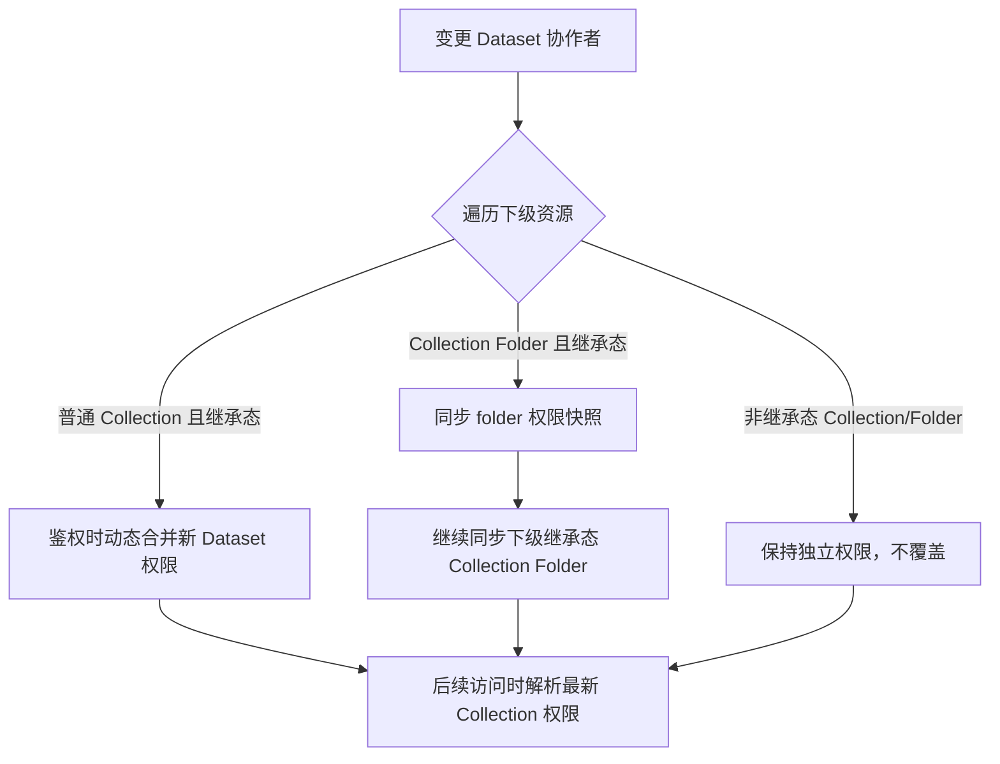
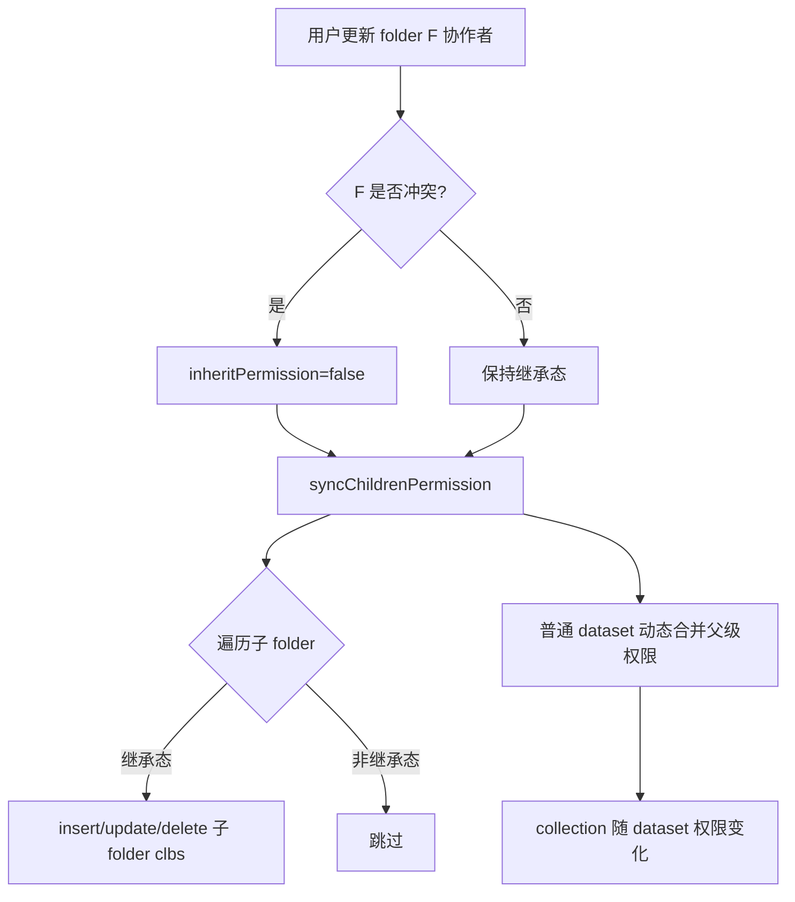
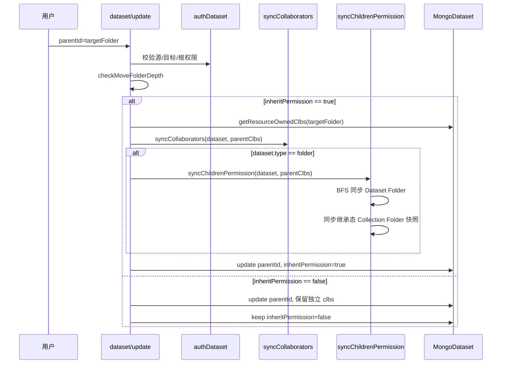
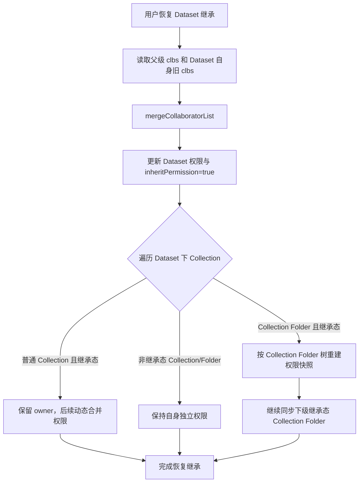
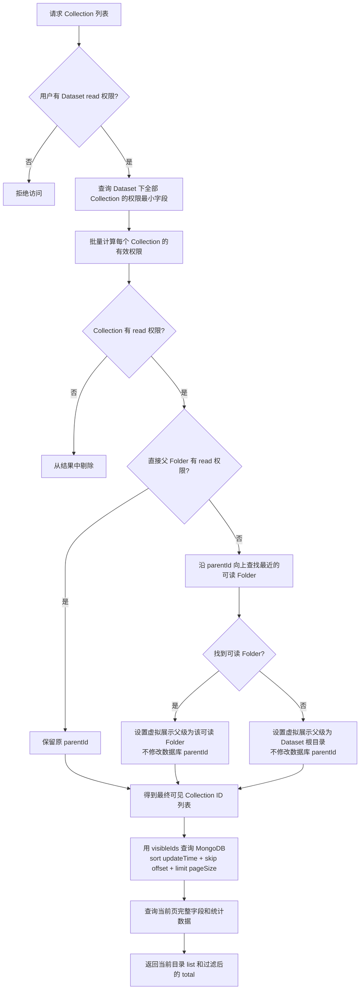
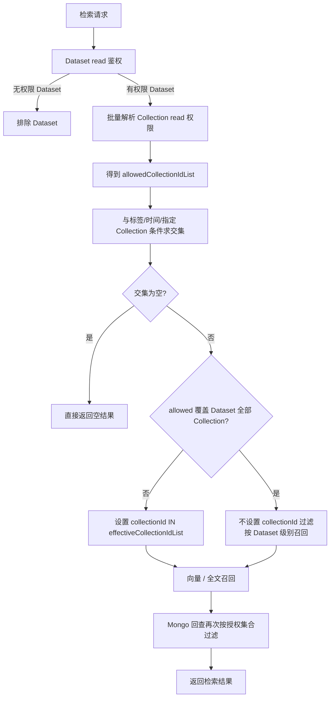

# 文件级权限管理设计文档

> 适用范围：FastGPT 知识库（Dataset）及其文件（Collection）的权限模型与可见性控制
> 关联需求：[doc/requirement/user-story.md](doc/requirement/user-story.md)、[doc/requirement/requirement.md](doc/requirement/requirement.md)

---

## 1. 背景与目标

### 1.1 背景

FastGPT 当前权限体系以 **team 为资源绑定单位**，权限粒度到 `dataset` 级别。同一 dataset 下的不同 collection（文件/文件夹）无法区分访问权限。

本次需求将权限粒度下沉到 **collection 级别**，并围绕继承/非继承状态、文件列表过滤、文件夹穿透平铺、当前路径搜索等能力完善文件级权限管理。

### 1.2 目标

1. 实现 collection 级别的独立权限配置（协作者、继承/非继承状态）。
2. 默认继承父级权限，显式非继承的资源仅使用自身权限。
3. 文件列表仅展示当前用户有权限的 collection。
4. 无权限文件夹下的有权限内容可平铺展示，隐藏完整路径。
5. 知识库列表搜索限定当前路径，不全局搜索。
6. 知识库检索（RAG 召回）按文件级权限过滤。
7. 性能：1w文件+权限配置 列表不超过2s、知识检索节点增加时延 100文件<200ms, 1w文件<1s；未配置文件权限，不影响检索性能

---

## 2. 术语与数据模型

### 2.1 核心术语

| 术语 | 说明 |
|------|------|
| Dataset | 知识库，类型包括 `folder`（文件夹）、`dataset`（普通知识库）、`websiteDataset`、`apiDataset` 等 |
| Collection | 知识库中的文件或文件夹，类型包括 `folder`、`file`、`link`、`apiFile` 等 |
| `inheritPermission` | 布尔字段，默认 `true`；为 `true` 时沿父链解析权限，为 `false` 时仅使用自身权限和 owner 权限 |
| clbs | 协作者列表（collaborators），存储在 `resource_permissions` 表中 |
| `resourceType` | 资源类型枚举，本次新增 `collection` |
| Owner / Manage / Write / Read | 权限位掩码：`owner=~0>>>0`、`manage=0b001`、`write=0b010`、`read=0b100` |

### 2.2 数据模型

#### 2.2.1 `datasets` 表（新增字段）

```typescript
{
  parentId?: ObjectId,          // 父 folder dataset
  type: DatasetTypeEnum,        // folder / dataset / websiteDataset / ...
  inheritPermission: Boolean,   // 默认 true

  hasSetCollectionPermissions: Boolean,  // 新增，默认 false；该 Dataset 下是否配置过 Collection 级权限（详见 6.4.3）
  
  tmbId: ObjectId,              // owner
  // ... 其他字段
}
```

#### 2.2.2 `dataset_collections` 表（新增字段）

```typescript
{
  parentId?: ObjectId,          // 父 collection folder
  datasetId: ObjectId,          // 所属 dataset
  type: DatasetCollectionTypeEnum,  // folder / file / link / ...
  inheritPermission: Boolean,   // 新增，默认 true
  tmbId: ObjectId,              // owner
  // ... 其他字段
}
```

#### 2.2.3 `resource_permissions` 表（扩展 resourceType）

```typescript
{
  teamId: ObjectId,
  tmbId?: ObjectId,
  groupId?: ObjectId,
  orgId?: ObjectId,
  resourceType: PerResourceTypeEnum,  // 新增 collection
  resourceId: ObjectId,
  permission: Number
}
```

**索引**：现有 `(resourceType, teamId, resourceId, groupId/orgId/tmbId)` 唯一索引继续用于单资源协作者唯一性；是否增加 Dataset 维度的冗余字段 `resourceSetId`，见 3.3 节方案选型。

---

## 3. 方案选型

### 3.1 权限存储方案

| 方案 | 思路 | 优点 | 缺点 |
|------|------|------|------|
| A. 纯动态合并 | 所有子资源都不存快照，鉴权时实时向上递归 | 一致性最好，无传播问题 | 树深时性能差，列表需递归 |
| B. 快照+动态合并（推荐） | folder 存快照；普通 dataset/collection 动态合并；变更时向下 bulkWrite 同步 | 读取快，列表简单 | 写入重，需保证事务/幂等 |
| C. 全快照 | 所有资源都存完整父级快照 | 读取最快 | 写入最重，冗余大 |

**推荐方案 B**，与 FastGPT 现有模型保持一致，改动最小。

### 3.2 列表过滤方案

重点评估当前 [listV2.ts](../../projects/app/src/pages/api/core/dataset/collection/listV2.ts) 的列表过滤方案。当前 `listV2` 使用 **offset 分页**：请求通过 `pageSize` 与 `offset` 或 `pageNum` 指定分页位置，服务端先将 `pageSize` 限制为最大 100，再按 `offset` 计算跳过数量，执行 MongoDB `skip(offset).limit(pageSize)`；未传 `offset` 时使用 `(pageNum - 1) × pageSize` 计算偏移量。接口同时执行 `countDocuments(match)` 返回未经过权限过滤的 `total`，因此当前分页是“数据库先分页、再返回”，不是游标分页，也不是过滤后精确分页。

以单个 Dataset 下 **1 万个 Collection、每个 Collection 平均 10 个协作者** 为容量基准，列表增加 Collection 权限过滤后，需要改为候选读取、批量鉴权、过滤并补足当前页，或另行引入游标分页。列表过滤需要区分“数据库读取量”和“权限计算量”。以下估算以每条权限记录约 200B、单用户请求、权限信息已建立索引为前提，实际数值会随协作者数量和 BSON 字段长度变化。

| 方案 | 数据库读取量（1 万 Collection，每个平均 10 个协作者） | 权限计算量 | 主要问题 | 结论 |
|------|--------------------------|------------|----------|------|
| A. 先查后过滤（单页查询） | 1. 首次最多读取 1 万条 Collection；2.按 `$in` 批量读取对应权限记录约 1 万～数万条，权限快照约 2～20 MB | 1.最多 1 万次 Collection 权限解析；2. 其中 Collection Folder 直接读取已同步快照，不递归父级；普通 Collection 仅需解析其所属 Dataset / Collection Folder 的有效权限，可复用相同父级结果| 1. 查询结果需过滤后再分页,单请求内存和 CPU 峰值较高 |  |
| B. 游标分页 + 先查后过滤 | 每页读取 `pageSize` 条 Collection，例如 100～200 条；每页读取对应权限记录约 100～数百条，单页约 20～400 KB | 每页最多 `pageSize` 次解析 | 需要客户端保存游标；无法直接返回精确总数 |  |
| C. 权限预计算 | 查询阶段读取已过滤的可见资源，通常为结果数 `k`；额外维护用户-资源可见性数据 | 查询阶段约 `O(k)`；权限变更时需要重新计算受影响资源，最坏约 `O(1 万 × 协作者数)` | 写入和权限传播成本高，数据一致性复杂 | |
| D. 两阶段 ID 过滤 | 先按业务过滤条件查询 Collection 的最小字段 `{ _id, parentId, type, inheritPermission, tmbId }`，根据返回的 ID 批量解析权限得到可读 Collection ID，再使用这些 ID 回查完整字段并分页 | 首次读取约 1 万条轻量 Collection 元数据；按 `$in` 读取相关权限记录约 1 万～数万条；第二次仅读取可见 Collection 的完整字段和统计数据 | 需要两次 Collection 查询；权限过滤后的精确分页需要在第二次查询前计算，`total` 也应使用可读 ID 数量；若可见率低，可显著减少完整字段和 `$lookup` 的读取量 | √ |

D方案 测试结果（分页，一页20，不包含平铺）:
1. 读取1w 默认条件（背景：root创建1w个文件，dataset增加协作者user1）user1.list 0.8~ 1.25s

2. 1w文件x10协作者 2.2s


#### 3.2.1 推荐实现

- Collection 和权限记录均使用 `$in` 批量查询，避免 N+1。
- 对继承态 Collection Folder 使用已同步的权限快照；普通 Collection 尽量复用 Dataset / Folder 的解析结果，避免重复递归。
- 若用户对 Dataset/Collection Folder 有 `read`，且当前范围内所有 Collection 都是继承态，可直接复用 Dataset/Collection Folder 的有效权限，权限计算从约 1 万次降为 1 次或少量批次。
- 团队所有者无需再进行权限解析，权限计算从约 1 万次降为 1 次或少量批次。


### 3.3 `resourceSetId` 方案选型

Collection 列表、检索和 Dataset 权限传播存在按 Dataset 批量读取 Collection 权限记录的需求，评估是否在 `resource_permissions` 中增加冗余归属字段 `resourceSetId`（`resourceType=collection` 时等于 `datasetId`）。

#### 3.3.1 方案对比

| 方案 | 查询方式 | 优点 | 缺点 | 结论 |
|------|----------|------|------|------|
| A. 不增加 `resourceSetId` | 先查询 `dataset_collections._id`，再按 `{ resourceType: collection, resourceId: { $in: collectionIds } }` 批量查询权限 | 不增加字段和索引；不产生冗余数据；与当前 `resource_permissions` 模型兼容 | 需要两次查询；1 万 Collection 会构造较大的 `$in`；列表、检索、权限迁移都需要先获取 Collection ID | **当前采用** |
| B. 增加 `resourceSetId` | 直接按 `{ resourceType: collection, teamId, resourceSetId: datasetId }` 查询 Dataset 下全部 Collection 权限 | Dataset 维度批量查询直接且可索引；适合列表鉴权、RAG 过滤、缓存重建和 Dataset 删除清理 | 增加字段和索引；权限记录冗余保存 Dataset ID；若未来支持跨 Dataset 移动，需要同步更新权限记录；需要额外迁移和一致性维护 | 暂不采用，后续按性能数据评估 |

**当前方案：不增加 `resourceSetId`。**

权限批量读取流程为：

1. 第一次查询 `dataset_collections`，按 `datasetId` 获取当前 Dataset 下 Collection 的最小字段和 `_id`。
2. 使用 Collection ID 列表批量查询：

```typescript
MongoResourcePermission.find({
  teamId,
  resourceType: PerResourceTypeEnum.collection,
  resourceId: { $in: collectionIds }
});
```

3. 按 `resourceId` 分组权限记录，再进行 Collection 权限解析、平铺和过滤。
4. 如果只需要当前用户相关权限，在上述条件上增加 `tmbId / groupId / orgId` 过滤。

#### 3.3.2 当前方案的约束

- `resourceId` 必须是 Collection ID，不能使用 Dataset ID 替代。
- 批量查询必须同时限定 `teamId` 和 `resourceType=collection`，不能仅依赖客户端提供的 Collection ID。
- `resourceSetId` 暂不写入 Schema、权限记录或索引。
- 现有唯一索引继续保证同一 Collection 下同一 `tmbId / groupId / orgId` 只有一条权限记录。
- 如果后续实测 `$in` 查询、列表鉴权或 RAG 过滤成为瓶颈，再单独评估增加 `resourceSetId`，不提前引入数据冗余和跨 Dataset 移动的一致性成本。

## 4. 修改概述

本章定义 Dataset 与 Collection 权限管理对外暴露的接口。接口统一遵循现有 FastGPT API 约定：写操作要求调用方具备目标资源 `manage` 权限，所有权限变更在事务中完成；响应中的权限字段以服务端解析结果为准，不允许客户端直接修改 owner 权限。

### 4.1 接口总览

| 接口 | 方法 | 用途 | 关键请求参数 | 权限要求 | 主要行为 |
|------|------|------|--------------|----------|----------|
| `/api/core/dataset/list` | GET | 查询当前路径下的 Dataset | `parentId`、`searchText` | Dataset 列表访问权限 | 仅返回当前路径下用户可见的 Dataset；搜索不跨路径 |
| `/api/core/dataset/update` | PUT | 更新或移动 Dataset | `id`、`parentId`、`inheritPermission` | 源 Dataset `manage`；移动到根目录还需团队创建权限 | 移动时按新父级权限合并；Folder Dataset 继续同步子 Folder 快照 |
| `/api/core/dataset/collaborator/update` | POST | 更新 Dataset 协作者 | `datasetId`、`collaborators` | Dataset `manage` | 更新 Dataset 权限，并同步继承态的子 Dataset Folder 与 Collection Folder 快照 |
| `/api/core/dataset/resumeInheritPermission` | POST | 恢复 Dataset 权限继承 | `datasetId` | Dataset `manage` | 合并父级权限，恢复继承态，并向下同步继承态 Folder 快照 |
| `/api/core/dataset/collection/list` | GET | 查询当前路径下的 Collection | `datasetId`、`parentId`、`searchText` | Dataset `read` | 先校验 Dataset `read`，再按 Collection `read` 过滤；无权限子目录下的可见内容可平铺 |
| `/api/core/dataset/collection/create`等创建collection接口 | POST | 创建 Collection | `datasetId`、`parentId`、`type`、`inheritPermission`（各子接口按场景补充文件、链接、模板、API 等参数） | 父级 `write` 或 `manage` | 所有创建入口统一遵循 Collection 权限模型：默认继承父级权限；Folder Collection 创建权限快照；`inheritPermission=false` 时创建独立权限资源 |
| `/api/core/dataset/collection/update` | PUT | 更新或移动 Collection | `collectionId`、`parentId`、`inheritPermission` | Collection `manage` | 移动时按目标父级重新计算权限；继承态 Folder Collection 同步子 Folder 快照 |
| `/api/proApi/core/dataset/collection/collaborator/update` | POST | 更新 Collection 协作者 | `collectionId`、`collaborators` | Collection `manage` | 冲突时切换为非继承态；Folder Collection 的权限变更同步到继承态子 Folder |
| `/api/core/dataset/collection/resumeInheritPermission` | POST | 恢复 Collection 权限继承 | `collectionId` | Collection `manage` | 清理非 owner 的独立权限，或按父级重建 Folder 快照，并同步子 Folder |
| Dataset 检索接口 | POST/GET | 知识库检索 | Dataset 查询参数 | Dataset `read` | 在 Dataset 鉴权后叠加可读 Collection 集合过滤，仅召回有权限文件内容 |

创建collection接口：`/api/core/dataset/collection/create`、`/api/core/dataset/collection/create/fileId`、`/api/core/dataset/collection/create/localFile`、`/api/core/dataset/collection/create/link`、`/api/core/dataset/collection/create/text`、`/api/core/dataset/collection/create/apiCollectionV2`、`/api/core/dataset/collection/create/images`、`/api/core/dataset/collection/create/backup`、`/api/core/dataset/collection/create/template`、`/api/proApi/core/dataset/collection/create/externalFileUrl`

### 4.2 接口通用约束

- `inheritPermission` 未传时默认为 `true`；显式传入 `false` 时资源进入独立权限状态。
- `collaborators` 为全量替换语义，owner 由资源 `tmbId` 派生，不能通过协作者接口授予或移除。
- Dataset `read` 是 Collection 访问的前置门槛；仅有 Collection 权限不能绕过 Dataset 权限。Dataset 详情接口只需校验 Dataset `read`，Collection 级别的可见性由 Collection 列表、详情和数据操作接口分别校验。
- 列表接口的权限过滤、详情鉴权和检索过滤必须复用同一权限解析函数。

---

## 6. Collection 权限核心设计

本章统一描述 Dataset 权限变更对 Collection 的影响，以及 Collection 自身的权限模型、解析和操作。


### 6.1 变更 Dataset 协作者如何影响其下的文件/文件夹

#### 6.1.1 当前实现路径

- 入口：`pro/admin/src/pages/api/core/dataset/collaborator/update.ts`
- 编排：`pro/admin/src/service/support/permission/controller.ts` 的 `updateResourceCollaborators`
- 传播：`packages/service/support/permission/inheritPermission.ts` 的 `syncChildrenPermission`

#### 6.1.2 对子 folder dataset 的影响

当目标 dataset 是 `folder` 时：

1. 系统计算新旧协作者差异和冲突。
2. 若冲突且处于继承态，将 folder 的 `inheritPermission` 置为 `false`。
3. 系统调用 `syncChildrenPermission`，将 folder 的新协作者 BFS 同步到所有 `inheritPermission=true` 的子 folder。
4. 对每个子 folder：
   - 父级有、子级没有的协作者 → `insertOne`
   - 父级有、子级也有的协作者 → `updateOne`，权限为 `sumPer(子现有, 父级)`
   - 父级已移除且子级权限与旧父级完全相同的协作者 → `deleteOne`

#### 6.1.3 对子普通 dataset 的影响

- `syncChildrenPermission` 只扫描 `folderTypeList` 中的资源，普通 dataset 不会被写入 `resource_permissions`。
- 子普通 dataset 在 `inheritPermission=true` 时，鉴权阶段动态合并父 folder 权限。
- 因此变更父 folder 协作者后，子普通 dataset 的权限**立即生效**，但不需要写权限表。

#### 6.1.4 对 collection / data 的影响

- Dataset 协作者变更后，必须同步影响其下的 Collection 权限：
  - 普通 Collection 在 `inheritPermission=true` 时不复制权限快照，鉴权阶段动态合并所属 Dataset / Collection Folder 的有效权限，因此权限立即生效。
  - Collection Folder 需要维护权限快照；当其处于继承态时，沿 Dataset Folder 的同步链路更新自身及下级继承态 Collection Folder 的 `resource_permissions`。
  - `inheritPermission=false` 的 Collection 或 Collection Folder 不被覆盖，继续使用自身独立权限。
- Dataset 协作者变更接口本身使用 `authDataset` 校验 Dataset `manage` 权限；变更完成后，普通 Collection 在后续访问时通过统一的 Collection 鉴权逻辑动态获得最新权限，Collection Folder 则使用已同步的权限快照。仅有 Collection 权限不能绕过 Dataset `read` 门槛。



因此 Dataset 权限变更后，Collection 的最终可见性和操作权限会立即更新，同时 Collection Folder 的权限快照保持与继承链一致。



---

### 6.2 Move Dataset 如何影响其下的文件/文件夹

移动 Dataset 时支持两种权限处理方式：默认继承新父目录权限，或保持资源原有的独立权限配置。继承新父目录时沿用当前实现的 `syncCollaborators + syncChildrenPermission`，并补充 Collection 相关权限同步；保持独立配置时不执行新父目录权限同步。

#### 6.2.1 当前实现路径

- 入口：`projects/app/src/pages/api/core/dataset/update.ts`
- 触发条件：`parentId !== undefined`

#### 6.2.2 关键步骤

1. 校验目标 folder / 源 folder / 根目录创建权限。
2. `checkMoveFolderDepth` 校验深度与成环。
3. 事务中根据请求的权限处理方式执行：
   - `inheritPermission=true`（默认）：
     - `getResourceOwnedClbs(parentId)` 读取目标父 folder 的显式协作者。
     - `syncCollaborators(id, parentClbs)` 将目标父 folder 权限合并到被移动 Dataset。
     - 如果被移动的是 Folder Dataset，调用 `syncChildrenPermission(dataset, parentClbs)` 继续向下同步。
     - 更新 `parentId`，并设置 `inheritPermission=true`。
   - `inheritPermission=false`：
     - 仅更新 `parentId`。
     - 保留被移动 Dataset 原有的独立 clbs，不同步目标父 folder 权限。
     - 保持 `inheritPermission=false`。

#### 6.2.3 对子资源的影响

- **被移动 folder**：
  - `inheritPermission=true` 时，自身 clbs 与目标父 folder 合并（父 owner 降级为 manage），子 folder 的 clbs 同步为目标父 folder 的权限快照。
  - `inheritPermission=false` 时，保留自身独立 clbs；其继承态子 folder 不因本次 move 重新同步目标父 folder 权限。
  - 子普通 dataset 在继承态下动态合并新的父级权限。
- **被移动普通 dataset**：
  - `inheritPermission=true` 时，自身 clbs 与目标父 folder 合并，并保持继承态。
  - `inheritPermission=false` 时，保留原有独立 clbs，不提供目标父 folder 权限。
  - 无子资源需要同步。
- **collection / data**：
  - Dataset move 本身不直接修改普通 Collection 的权限记录；普通 Collection 处于继承态时，后续鉴权按新的 Dataset / Collection Folder 父链动态解析权限。
  - Collection Folder 属于需要维护权限快照的 folder 资源：当 Dataset 以 `inheritPermission=true` 移动并完成 `syncCollaborators + syncChildrenPermission` 后，必须沿新的 Dataset 权限链同步其下所有继承态 Collection Folder 的 `resource_permissions` 快照；下级继承态 Collection Folder 继续同步，非继承态 Collection Folder 跳过。
  - 当 Dataset 以 `inheritPermission=false` 移动时，不同步目标父级权限；其下 Collection Folder 的继承关系仍基于该 Dataset 的独立权限，已有独立权限保持不变。
  - 非继承态普通 Collection / Collection Folder 继续使用自身独立权限，不被 Dataset move 覆盖。



---

### 6.3 Dataset 恢复继承如何影响其下的文件/文件夹

`resumeInheritPermission` 的行为与当前 Dataset 实现保持一致，并补充 Collection 相关权限恢复和同步逻辑：恢复继承后，根据资源类型执行现有的父级权限合并和子 Folder 同步逻辑。

#### 6.3.1 当前实现路径

- 入口：`projects/app/src/pages/api/core/dataset/resumeInheritPermission.ts`
- 核心：`packages/service/support/permission/inheritPermission.ts` 的 `resumeInheritPermission`

#### 6.3.2 关键步骤

1. 读取父级真实协作者 `parentClbs`。
2. 读取自身旧协作者 `oldMyClbs`。
3. `mergeCollaboratorList(parentClbs, oldMyClbs)` 合并，父级 owner 降级为 manage。
4. 如果是 folder：
   - `syncCollaborators` 将合并后的协作者写入自身。
   - `syncChildrenPermission` 向子 Dataset Folder 同步。
5. **同步 Collection 权限**（`syncDatasetCollectionFolders`，复用通用原语）：
   - 取每个 Dataset（含后代）下 **parentId 为空且继承态** 的根 Collection Folder。
   - `syncCollaborators`：将 Dataset 有效 clbs（父级 owner 映射为 manage）并入根 folder 自身快照（sumPer）。
   - `syncChildrenPermission`：以根 folder 为资源向继承态子 folder 传播（sumPer、保守删除、非继承态切断）。
   - 对普通 Collection，不写入完整权限快照；设置/保持 `inheritPermission=true` 后，后续鉴权时动态合并恢复后的 Dataset / Collection Folder 权限。
   - 非继承态 Collection Folder 或普通 Collection 不被本次 Dataset 恢复继承覆盖，继续使用自身独立权限。
6. 将 Dataset 的 `inheritPermission` 置为 `true`。

#### 6.3.3 对子资源的影响

- **folder 恢复继承**：
  - Dataset 自身 clbs 恢复为“父级 + 自身旧权限”的合并快照。
  - Dataset 子 Folder 的 clbs 同步为合并后的快照。
  - 其下继承态 Collection Folder 按 Collection Folder 树重新生成权限快照；普通 Collection 不生成完整快照，动态合并新的 Dataset / Collection Folder 权限。
  - 非继承态 Collection / Collection Folder 保持自身独立权限。
- **普通 dataset 恢复继承**（当前实现）：
  - 仅将 `inheritPermission` 置为 `true`。
  - 自身旧 clbs 不会被删除，将参与后续动态合并。
  - 其下继承态 Collection Folder 需要根据恢复后的 Dataset 有效权限重建权限快照；普通 Collection 继续动态合并。
  - 非继承态 Collection / Collection Folder 不被覆盖。
  - **注意**：函数注释声称会删除自身 clbs，但当前代码并非如此，设计文档需明确此行为并建议后续统一。



---

### 6.4 Collection 权限数据模型

#### 6.4.1 Schema 变更

在 `dataset_collections` 中新增：

```typescript
inheritPermission: {
  type: Boolean,
  default: true
}
```

在 `resource_permissions.resourceType` 枚举中新增 `collection`。

#### 6.4.2 不变量

- 继承态非 folder collection：至少包含自身 owner 记录；若新增协作者与父级权限无冲突，可保持继承态并写入该协作者记录（解析时与父级权限按位或合并）。
- 继承态 collection folder：与 dataset folder 采用**同一继承模型**（`syncChildrenPermission` sumPer 语义）。folder 自身 clbs 是其配置（创建时并入父级，owner→manage；根 folder 需有自身 owner 记录）；变更时自身 clbs 全量替换为目标配置，子 folder 快照 = **sumPer(子自身, 父级)** 累加，**保守删除**（仅当协作者不在父级且子权限与父记录完全一致时移除）。
- 非继承态 collection：拥有独立 clbs 配置（含自身 owner 记录），不再从父级继承权限；`syncChildrenPermission` 对非继承态 folder 天然切断（不加载、不被覆盖，其下继承态 folder 也不再被同步）。

> 注：早期设计为「父级镜像 + 自身 owner」的精确快照（`syncCollectionFolderPermission`），已统一为 `syncChildrenPermission` 累加模型以与 dataset folder 保持一致。

#### 6.4.3 `hasSetCollectionPermissions` 短路标记

在 `datasets` 中新增 `hasSetCollectionPermissions: Boolean`（默认 `false`），表示该 Dataset 下**是否配置过 Collection 级权限**（独立/自定义）。

**语义**：

- `false`（默认）：该 Dataset 下没有任何 Collection 配置独立权限。所有 Collection 均为纯继承（非 folder 仅 owner 记录；Collection Folder 快照沿 Dataset 权限链 sumPer 派生）。此时每个 Collection 的有效权限 = Dataset 有效权限（父 owner 不透传、cap 为 manage），collection 级鉴权可**短路为 Dataset 级鉴权**。
- `true`：至少一个 Collection 配置了独立/自定义权限（`inheritPermission=false`、追加非 owner 协作者、独立 move）。collection 级鉴权必须走完整解析（`getReadableCollectionIds` / `resolveCollectionPermission`）。
- 旧数据（字段缺失 `undefined`）按**未知**处理，不做短路（走完整解析）。原因：迁移前存量 Dataset 可能已含非继承态 Collection，短路会基于 Dataset 权限错误放行；正确性优先。升级迁移（§12）统一写入显式 `false` 后短路生效。

**置位规则（单向，只增不减）**：以下写操作必须将所属 Dataset 的 `hasSetCollectionPermissions` 置为 `true`：

| 写操作 | 触发条件 |
|--------|----------|
| Collection 协作者配置（pro `/collection/collaborator/update`，走通用 `updateResourceCollaborators`） | 任意协作者更新 |
| 创建 Collection（`createCollectionPermission`） | `inheritPermission=false`（独立态） |
| 移动 Collection（`moveCollectionPermission`） | `inheritPermission=false`（独立态） |

**复位**：不提供置回 `false` 的路径。恢复继承（`resumeInheritPermission`）只恢复 `inheritPermission=true`，不删除继承态 collection 上已追加的自定义协作者记录，因此不能复位。stale `true` 只损失短路优化、不损失正确性（完整解析仍正确）；`false` 时短路依赖「无任何自定义」这一前提，因此置 `true` 必须保守覆盖所有自定义路径。

**短路点**（优先校验该字段，仅**显式 `false`** 触发）：

| 位置 | 短路行为 |
|------|----------|
| `getReadableCollectionIds`（列表/详情批量） | `false` 且 Dataset read 通过 → 直接返回全部 Collection ID，跳过 `resource_permissions` 批量查询 |
| `resolveReadableCollectionIds`（RAG） | 批量读取各 Dataset 该字段；`false` 且该 Dataset read 通过 → 该 Dataset 全部文件 Collection 可读，跳过逐 Collection 解析 |
| `authDatasetCollection`（单资源鉴权） | Dataset read 门槛后，`false` → 有效权限 = Dataset 有效权限（owner→manage cap；collection owner 保留 owner），跳过 `resolveCollectionPermission` |
| `listV2` | `false` → 直接全部可读，替代全继承态 O(N) 扫描 |

**安全约束**：该短路只优化「纯继承」场景，不改变权限边界 —— Dataset read 仍是前置门槛；`false` 时任一 Collection 的有效权限与 Dataset 有效权限一致，因此短路结果与完整解析完全等价。

### 6.5 Collection 权限解析

#### 6.5.1 authDatasetCollection 解析规则

单个资源鉴权规则，用于 create / update / 协作者变更等单资源操作。

```
resolvePermission(resourceId, resourceType, tmbId):
  R = 查询资源 { inheritPermission, parentId, datasetId, type }
  
  # 1. 父级有效权限
  # folder 资源使用已同步的权限快照，不在鉴权时动态向上递归
  if inheritPermission == true 且 R.type != folder 且 存在父级:
     父引用 = (resourceType == collection) 
              ? (parentId 非空 ? parentId : datasetId)
              : (parentId 非空 ? parentId : null)
     父类型 = (resourceType == collection)
              ? (parentId 非空 ? collection : dataset)
              : dataset
     parentEffective = resolvePermission(父引用, 父类型, tmbId)
  else:
     parentEffective = 0
  
  # 2. 父级 owner 位封顶为 manage（不透传 owner）
  parentContribution = (parentEffective == OwnerRoleVal) ? ManageRoleVal : parentEffective
  
  # 3. 自身 clbs
  myPer = getTmbPermission(resourceType, teamId, tmbId, resourceId)
  
  # 4. 合并
  return sumPer(parentContribution, myPer)
```

#### 6.5.2 关键约束

- **父级 owner 不透传**：父级 owner 经继承链在子资源上至多获得 `manage`，不能获得子资源 `owner` 级操作权。
- **folder 资源存快照**：folder（dataset folder / collection folder）需要维护完整的 `resource_permissions` 快照。
- **非 folder 资源动态合并**：普通 dataset / 普通 collection 在 `inheritPermission=true` 时，鉴权阶段动态合并父级权限。
- **owner 记录唯一来源**：owner 记录由资源 `tmbId` 派生，协作者接口不可授予/移除 owner。

### 6.6 Collection 协作者配置接口

- **路径**：`POST /api/proApi/core/dataset/collection/collaborator/update`
- **鉴权**：目标 Collection 的 `manage` 权限及以上（`authDatasetCollection`）。
- **输入**：
  - `collectionId`
  - `collaborators`：全量协作者列表
- **实现**：该接口**直接复用通用 `updateResourceCollaborators`**（与 dataset/app 协作者更新同一链路），外围补充 Collection 专属处理：

  1. `authDatasetCollection` 校验 Collection `manage`，返回 collection（含 `datasetId`/`parentId`/`inheritPermission`/`type`）。
  2. 标记所属 Dataset `hasSetCollectionPermissions=true`（`markDatasetCollectionPermissionsSet`，短路前提）。
  3. 计算 `parentClbs`：有 `parentId` 取父 Collection Folder 快照；根 Collection 取所属 Dataset 的**实际（有效）clbs**（`getDatasetEffectiveClbs`：自身 + 直接父级 Dataset Folder 全量快照，参照 `authDatasetByTmbId`）。
  4. 计算 `oldChildClbs`：Collection 自身现有 clbs。
  5. 调用 `updateResourceCollaborators`（`resourceType=collection`、`resourceModel=MongoDatasetCollection`、`folderTypeList=[folder]`）：
     - folder 由其内部执行 `syncChildrenPermission`（sumPer 累加，非继承态切断）；
     - 冲突时（`inheritPermission && isConflict && !!parentId`）将 `inheritPermission` 翻转为 `false`；
     - 自身 clbs 全量替换（folder / 冲突）或差分更新（非 folder 无冲突）。
  6. 回读 collection 的 `inheritPermission` 返回。

- **owner 处理**：与 dataset/app 一致，接口不强制 owner 不可变（owner 由客户端在全量列表中原样携带；owner 变更走专用 `changeOwner` 流程）。早期设计为 Collection 增加的 owner 严格校验与 `sanitizeCollaboratorPermissions` 规范化，已随独立的 `updateCollectionCollaborators` 一并移除，保持与通用链路一致。
- **响应**：`{ inheritPermission: boolean }`（冲突时 false，否则保持原值）。

### 6.7 创建 Collection

- **入口**：`POST /api/core/dataset/collection/create`
- **输入**：
  - `parentId`：父 collection folder（可选）
  - `datasetId`：所属 dataset
  - `type`：collection 类型
  - `inheritPermission`：可选布尔，默认 `true`
  - 其他创建字段
- **逻辑**：
  1. 新 collection 默认 `inheritPermission=true`；若接口显式传入 `inheritPermission=false`，则创建为独立态。
  2. 创建 folder collection 时：
     - 计算父级 clbs：有 `parentId` 取父 Collection Folder 快照；根 Collection（`parentId` 空）取所属 Dataset 的**实际（有效）clbs**（`getDatasetEffectiveClbs`，而非仅 Dataset 自身 clbs）。
     - 快照 = merge(父级 clbs, [自身 owner])（父级 owner→manage 由 `mergeCollaboratorList` 完成），**直接 `insertMany` 落库**（新资源无既有记录，无需差异替换）。
  3. 创建非 folder collection 时：
     - 仅写入自身 owner 记录；若传入 `inheritPermission=false`，保持独立态。
  4. 独立态（`inheritPermission=false`）创建时置所属 Dataset `hasSetCollectionPermissions=true`。

### 6.8 移动 Collection

- **入口**：`PUT /api/core/dataset/collection/update`，传入 `parentId` 视为 move。
- **输入**：
  - `collectionId`
  - `parentId`：目标位置（`null` 表示根目录）
  - `inheritPermission`：可选布尔，未传时保持 Collection 原继承状态（不再默认 `true`）
- **策略**：
  - `inheritPermission=true`（默认）：沿用当前 Dataset move 的权限同步语义，继承新父级权限；执行 `syncCollaborators + syncChildrenPermission`，并同步 Collection Folder 及其下级继承态 Collection Folder 的权限快照。
  - `inheritPermission=false`：保持 Collection 原有独立配置，仅更新 `parentId`，不继承新父级 clbs；其下已有独立配置的子资源保持不变。
- **事务中**：
  - 若 `inheritPermission=true`：目标父级 clbs = 目标父 Collection Folder 快照，`targetParentId` 为空（根目录）时为所属 Dataset 有效 clbs（`getDatasetEffectiveClbs`）。folder 经 `syncCollaborators` 并入目标父级 clbs（owner→manage，sumPer 保留自身独立 clbs 与 owner），再经 `syncChildrenPermission` 向继承态子 folder 同步（sumPer 累加、保守删除）；非 folder 仅 `syncCollaborators` 合并目标父级 clbs。
  - 若 `inheritPermission=false`：仅更新 `parentId`，保留自身独立 clbs。
  - `inheritPermission` 未传时保持 Collection 原有继承状态（不再默认 `true`）。

### 6.9 恢复 Collection 继承

- 入口：`POST /api/core/dataset/collection/resumeInheritPermission`
- 逻辑与当前 `resumeInheritPermission` 实现保持一致，并补充 Collection 级处理：
  - 非 folder：置 `inheritPermission=true`，后续动态合并父级权限。
  - folder：经 `syncCollaborators` 并入父级 clbs（owner→manage，sumPer 保留自身独立 clbs 与 owner），置 `inheritPermission=true`，继承态子 folder 经 `syncChildrenPermission` 同步（sumPer）。
  - 非继承态子 Collection / Collection Folder 保持独立配置，不被恢复继承操作覆盖。

---

## 7. 新增可见性需求设计

### 7.1 文件列表按权限过滤

#### 7.1.1 目标

`GET /api/core/dataset/collection/list` 仅返回当前用户对 collection 解析为 `read` 及以上的文件。

#### 7.1.2 当前接口分页现状

当前 Collection 列表存在两个实现：`list.ts`（已标记 deprecated）和 `listV2.ts`。

- `list.ts`：支持 `pageNum` 和 `pageSize` 分页，`pageSize` 默认 10、最大 100；非 `simple` 模式通过 MongoDB `skip + limit` 分页，并同时返回 `total`。
- `listV2.ts`：支持 `pageNum + pageSize`，也支持直接传入 `offset`；服务端将 `pageSize` 限制为最大 100，使用 `skip(offset) + limit(pageSize)`，并返回 `total`。
- 两个接口当前均为**偏移分页**，不是游标分页；`total` 通过额外的 `countDocuments(match)` 查询获得。
- `simple=true` 仍会限制返回条数，但查询 `total` 时没有权限过滤；后续增加 Collection 权限过滤时，必须在过滤后重新补足分页结果，不能直接沿用当前 `total` 语义。
- 当前查询在 `searchText` 非空时不追加 `parentId` 条件，因此搜索行为与“限定当前路径”的需求仍不一致，需要单独调整。

#### 7.1.3 实现策略

采用两阶段 ID 过滤，避免在首次查询时加载完整 Collection 字段和统计数据：

1. 按 Dataset 范围查询 Collection 候选数据；进入 Dataset 根目录时，不能仅使用 `parentId=null` 限制候选集，否则无法发现隐藏 Collection Folder 下用户有权限的 Collection。此时应以 `datasetId` 为边界查询该 Dataset 下的 Collection，并保留 `parentId`、`type` 等字段用于后续目录层级判断。
2. 对候选 Collection 使用 `$in` 批量加载权限记录，避免 N+1 查询。
3. 对候选 Collection 批量解析当前用户权限：
   - Collection Folder 直接读取已同步的权限快照。
   - 普通 Collection 动态合并 Dataset / Collection Folder 的有效权限，并复用同一父级的解析结果。
4. 过滤出权限为 `read` 及以上的 Collection，得到可读集合 R（含 `_id`、`parentId`）。
5. 在内存中对可读集合 R 构建平铺层级、得到展平列表 L（详见 7.2.3）。
6. 分页：`total = |R|`；当前页 = `L[offset, offset + pageSize)`。
7. 仅对当前页节点回查完整字段及 `dataAmount / trainingAmount` 等统计，避免对全部可读节点执行 `$lookup`；`simple=true` 时遵循同一权限过滤结果，不得返回未过滤的总数。

#### 7.1.4 性能考虑

- 使用 `$in` 批量加载权限记录，避免 N+1。
- 第一阶段只读取最小字段，第二阶段只对可读 ID 回查完整字段和数据统计；可见率越低，节省的完整字段和 `$lookup` 读取量越明显。
- 对全继承态 Dataset 可走短路：若用户对 Dataset 有 `read` 且全部 Collection 均为继承态，可直接生成可读 ID 集合，无需逐条递归解析。
- Collection Folder 使用已同步权限快照；普通 Collection 复用 Dataset / Collection Folder 的有效权限结果，避免重复递归。

### 7.2 文件夹权限穿透与平铺展示

#### 7.2.1 目标

- Dataset（知识库）的展示保持当前实现，不因用户对 Dataset 所属文件夹无整体权限而改变 Dataset 的层级展示规则。
- 在已展示的 Dataset 内，Collection 列表按 Collection 级别 `read` 权限过滤。
- 用户对 Collection 父 folder 无整体权限，但对其下某个 Collection 有 `read` 权限时，该 Collection 可以脱离不可见的父 folder 层级平铺展示。
- 仅拥有 Collection 权限但没有所属 Dataset `read` 权限时，不展示该 Dataset，也不展示其下 Collection。
- 平铺结果不暴露完整隐藏路径。

#### 7.2.2 实现策略

1. Dataset 列表沿用当前实现，不在本需求中改动 Dataset 的展示、层级和过滤规则。
2. 用户进入已展示的 Dataset 后，Collection 列表按以下规则过滤和组织：
   - 先校验当前用户对 Dataset 具有 `read` 权限；没有 Dataset `read` 时直接返回空列表或拒绝访问。
   - 进入 Dataset 根目录时，不能仅使用 `parentId=null` 限制候选集，否则无法发现隐藏 Collection Folder 下用户有权限的 Collection；此时应以 `datasetId` 为边界查询该 Dataset 下的 Collection，并保留 `parentId`、`type` 等字段用于后续目录层级判断。
   - 进入某个 Collection Folder 时，以该 Folder 为可见范围查询其所有下级 Collection，而不是只查询直接子节点；沿 `parentId` 祖先链计算每个下级 Collection 的可见父级。无权限的中间 Folder 不阻断下级有权限 Collection 的返回，下级 Collection 平铺到当前可见列表。
   - 使用两阶段 ID 过滤方案批量解析每个候选 Collection 的有效权限。
   - 有效权限小于 `read` 的 Collection 直接剔除，不返回其 ID、名称、类型或其他字段。
   - 有效权限达到 `read` 的 Collection 保留；对 Collection Folder 继续判断其父级路径是否可见。
   - 父 Collection Folder 也有 `read` 权限时，按原有 `parentId` 层级返回。
   - 父 Collection Folder 没有 `read` 权限但当前 Collection 有 `read` 权限时，将当前 Collection 放到最近的可见父级列表中平铺返回；返回时不暴露不可见父级的名称和完整路径。
   - 仅有某个 Collection 的权限不能反向提升其父 Folder 或所属 Dataset 的可见性。

#### 7.2.3 平铺与分页的可复用函数设计

以下是供列表、检索复用的抽象函数，不包含具体 API 编排逻辑。

```typescript
/** 按 resourceId 分组权限记录 */
function groupRolesByResourceId(roleList: any[]): Map<string, any[]> {
  const map = new Map<string, any[]>();
  for (const role of roleList) {
    const key = String(role.resourceId);
    const list = map.get(key) ?? [];
    list.push(role);
    map.set(key, list);
  }
  return map;
}
/**
 * 从已按当前用户过滤的权限记录中，算出该用户对某 resourceId 的自身角色与是否 owner。
 * - personal（tmbId）优先；否则 group/org 用 sumPer 合并（与 getTmbPermission 语义一致）。
 * - owner 由资源 `tmbId` 派生（见 6.6），权限表中以 `permission === OwnerRoleVal` 的 tmbId
 *   记录承载；两者应一致，changeOwner 需同步更新 `tmbId` 字段与 owner 权限记录。
 */
function computeOwnRole(roles: any[], tmbId: string): OwnRoleType {
  const ownerRole = roles.find((role) => !!role.tmbId && role.permission === OwnerRoleVal);
  const isOwner = !!ownerRole && String(ownerRole.tmbId) === String(tmbId);

  const tmbRole = roles.find((role) => !!role.tmbId)?.permission;
  const groupAndOrgRole = sumPer(
    ...roles
      .filter((role) => !!role.groupId || !!role.orgId)
      .map((role) => role.permission)
  );

  return { role: tmbRole ?? groupAndOrgRole, isOwner };
}

/**
 * 构造 MongoResourcePermission 查询：resourceId + 值匹配当前用户（tmbId/groupId/orgId）。
 * 通过 `permission: { $bitsAnySet: 0b111 }` 在查询端只保留命中任一标准角色
 * （read=0b100 / write=0b010 / manage=0b001）的记录，owner 全位自然命中；
 * permission=0 的拒绝记录、不含读的高位自定义角色在此被排除，避免"有记录即放行"。
 * 注意：`$bitsAnySet` 要求整型；若 `permission` 以 BSON double 存储（owner=4294967295
 * 超 int32），需实测兼容性或改存 Int32。
 */
function buildPermissionQuery({
  teamId,
  resourceIds,
  tmbId,
  groupIds,
  orgIds
}: {
  teamId: string;
  resourceIds: string[];
  tmbId: string;
  groupIds: string[];
  orgIds: string[];
}) {
  return {
    resourceType: PerResourceTypeEnum.collection,
    teamId,
    resourceId: { $in: resourceIds },
    $or: [
      { tmbId },
      ...(groupIds.length ? [{ groupId: { $in: groupIds } }] : []),
      ...(orgIds.length ? [{ orgId: { $in: orgIds } }] : [])
    ]
  };
}

export type CollectionPermissionItemType = Pick<
  DatasetCollectionSchemaType,
  '_id' | 'tmbId' | 'parentId' | 'inheritPermission' | 'type'
>;

/**
 * 批量计算用户可读（有效权限 ≥ read）的 Collection ID，供列表、检索复用。
 * 与 6.5.1 resolvePermission 保持同一语义，仅做 Collection 级过滤：
 * - 可读判定已下推到查询端（buildPermissionQuery 的 $bitsAnySet），保持一次 distinct
 *   查询、只回去重 ID，不拉权限值、不做内存分组；
 * - folder：读已同步权限快照（自身记录即完整有效权限，不向上递归）；
 * - 非 folder 继承态：自身可读，或父级可读（父 Collection Folder 快照，或根级 Dataset）；
 * - 非继承态：仅自身可读。
 * 前置条件：调用方已通过 Dataset read 鉴权；根级继承态 Collection 的可读性依赖
 * datasetPermission（Dataset 有效角色），避免仅凭 parentId 为空就放行。
 * 返回结果含 folder ID；检索使用前需将 folder 递归展开为其下文件 Collection ID（见 7.3.2）；
 * 多 Dataset 检索需按 datasetId 分组分别调用。
 */
export async function getReadableCollectionIds({
  collections,
  tmbId,
  teamId,
  groupIds,
  orgIds,
  datasetPermission
}: {
  collections: CollectionPermissionItemType[];
  tmbId: string;
  teamId: string;
  groupIds: string[];
  orgIds: string[];
  /** 调用方已解析的 Dataset 有效角色（role 位掩码），用于根级继承态 Collection。 */
  datasetPermission: PermissionValueType;
}): Promise<string[]> {
  if (collections.length === 0) return [];

  // 需要读取权限的资源：Collection 自身 + 其父 Collection Folder（继承判定用）
  const resourceIdSet = new Set<string>();
  for (const item of collections) {
    resourceIdSet.add(String(item._id));
    if (item.parentId) resourceIdSet.add(String(item.parentId));
  }

  // 一次查询、去重、只回 ID：可读判定已在查询端通过 $bitsAnySet 过滤
  const readableResourceIds = new Set(
    (
      await MongoResourcePermission.distinct(
        'resourceId',
        buildPermissionQuery({
          teamId,
          resourceIds: Array.from(resourceIdSet),
          tmbId,
          groupIds,
          orgIds
        })
      )
    ).map(String)
  );

  const readableIds: string[] = [];
  for (const item of collections) {
    const itemId = String(item._id);
    const parentId = item.parentId ? String(item.parentId) : null;
    const isFolder = item.type === DatasetCollectionTypeEnum.folder;

    const selfReadable = readableResourceIds.has(itemId);
    // 仅非 folder 继承态才继承父级；父级 = 父 Collection Folder（快照）或根级 Dataset
    const inheritedReadable =
      item.inheritPermission !== false &&
      !isFolder &&
      parentId && readableResourceIds.has(parentId);

    if (selfReadable || inheritedReadable) {
      readableIds.push(itemId);
    }
  }

  return readableIds;
}

```


以用户进入 Dataset 根目录（`parentId` 为空）为例，候选集为整个 Dataset 下的全部 Collection：

1. **候选查询**：查询该 Dataset 下所有 Collection 的权限与层级最小字段 `{ _id, parentId, type, inheritPermission, tmbId }`，不按 `parentId` 过滤，否则发现不了隐藏 Folder 下用户有权限的文件。第一阶段不需要读取 `updateTime`，排序交由第二次 MongoDB 查询完成。
2. **权限解析**：两阶段批量加载权限并解析，得到可读集合 R（有效权限 ≥ `read`）。此阶段只保留权限解析、父子关系和平铺所需的最小元数据，不查询 Collection 详情和数据统计字段。
3. **构建平铺层级（内存中）**：
   - 按 `parentId` 建立 Collection 目录树（含不可读节点），并维护一个“最近可读祖先”指针 `nearestVisible`，初始为 Dataset 根（`null`）。
   - 采用**自顶向下**一次遍历，对每个节点：
     - 若该节点可读：其展示父级 = `nearestVisible`；然后把 `nearestVisible` 更新为当前节点。
     - 若该节点不可读：`nearestVisible` 保持不变，继续向下遍历其子节点。
   - 不可读节点不参与展示，但其下可读的子孙节点会被提升到 `nearestVisible` 下，从而跳过无权限中间 Folder。
   - 每个节点只被访问一次，总复杂度 `O(N)`，不随目录深度退化为 `O(V × D)`，也无需向上逐级回溯。
4. **生成当前目录 ID 集合**：从逻辑树中筛选“展示父级等于当前目录”的节点，得到当前目录应展示的 Collection ID 集合 `visibleIds`；`total = visibleIds.length`。
5. **MongoDB 排序并分页查询详细数据**：使用 `{ _id: { $in: visibleIds } }` 第二次查询 `dataset_collections`，由 MongoDB 执行 `.sort({ updateTime: -1 }).skip(offset).limit(pageSize)`，直接获取当前页完整 Collection 字段，无需在内存中排序和截取 `pageIds`。
6. **查询当前页统计数据**：仅针对第二次查询返回的当前页 Collection ID，聚合查询 `dataAmount / trainingAmount / trainingStatus` 等统计并合并到结果中。`total` 只统计当前展示范围内的 Collection，不统计属于其他可读目录的下级节点。

**示例**：Dataset D 下，Folder A（用户无权限）含 C1、C2（用户有权限），Folder B（用户有权限）含 C3，根下有 C4（用户有权限）：

- 可读集合 R = { Folder B, C1, C2, C3, C4 }。
- 根目录的平铺结果 L = { Folder B, C1, C2, C4 }；C3 属于 Folder B 的下级，不计入根目录列表。
- 使用根目录 ID 集合查询 MongoDB，由 MongoDB 按 `updateTime` 降序排序并执行 `skip/limit` 分页；根目录 `total=4`。

**权限解析短路规则**：

- **团队管理员 / 团队所有者**：在 Dataset `read` 前置鉴权通过后，直接视为对该 Dataset 下所有 Collection 拥有可读权限，不逐条解析 Collection 权限；但仍按当前目录范围、Collection 类型、平铺规则和分页返回结果，不改变真实 `parentId`，也不返回隐藏路径信息。
- **`hasSetCollectionPermissions === false`（无 Collection 自定义权限，§6.4.3）**：优先校验该字段。纯继承 Dataset 下每个 Collection 的有效权限 = Dataset 有效权限，Dataset `read` 已通过即全部可读，O(1) 短路，无需扫描 `inheritPermission` 字段，也无需读取 `resource_permissions`。
- **全部 Collection 均为继承态**：若用户已拥有 Dataset `read`，且当前 Dataset 范围内的 Collection（包括 Collection Folder）均为 `inheritPermission=true`，则普通 Collection 可直接复用 Dataset 或所属 Collection Folder 的有效权限；Collection Folder 直接读取已同步的权限快照，不逐条递归父链。若 Dataset 的有效权限满足 `read`，可直接生成当前范围的可读 Collection ID 集合，再进行平铺、排序和分页。
- **存在非继承态 Collection**：不能使用上述全量短路，必须对非继承态 Collection 单独解析自身权限；继承态 Collection 仍可复用其父级解析结果。

**计算复杂度分析**：

定义：

- `N`：当前 Dataset 下 Collection 总数，容量基准为 10,000。
- `P`：本次批量读取的 `resource_permissions` 记录数；每个 Collection 平均 10 个协作者时，最坏约为 `10N`，即 100,000 条。
- `F`：Collection Folder 数量，`F <= N`。
- `D`：Collection 最大目录深度。
- `V`：用户可读 Collection 数量，`V <= N`。
- `K`：当前目录平铺后实际展示的节点数，`K <= V`。
- `S`：当前页大小，当前 `listV2` 最大为 100。

| 阶段 | 时间复杂度 | 空间复杂度 | 说明 |
|------|------------|------------|------|
| 查询最小字段 | 数据库读取量 `O(N)` | 应用侧 `O(N)` | 首次只读取 `_id / parentId / type / inheritPermission / tmbId` 等权限和层级字段；实际耗时取决于 `datasetId` 索引和候选数量 |
| 批量读取权限记录 | 数据库读取量 `O(P)` | 应用侧 `O(P)` | 使用 `resourceType + resourceId` 等索引和 `$in` 批量读取；10 个协作者场景的记录量上界约为 `P = 10N`，实际应只加载与当前用户相关的权限记录 |
| 权限记录分组 | `O(P)` | `O(P)` | 按 `resourceId` 建立权限映射，避免逐条查询 |
| Collection 权限解析 | 缓存后 `O(N + P)` | `O(N)` | Collection Folder 直接读取已同步快照；普通 Collection 复用 Dataset / Collection Folder 的有效权限结果；不缓存父级结果会额外退化为 `O(N × D)` |
| 构建父子索引 | `O(N)` | `O(N)` | 建立 `_id -> node`、`parentId -> children` 映射，并用于祖先链查找 |
| 计算虚拟展示父级 | 缓存后 `O(V)`；无缓存最坏 `O(V × D)` | `O(V)` | 只对权限达到 `read` 的节点计算最近可读祖先；用记忆化缓存避免重复沿 `parentId` 扫描 |
| 当前目录筛选 | `O(V)` | `O(K)` | 只保留虚拟展示父级等于当前目录的节点，得到 `visibleIds`；`K` 为当前目录实际展示节点数 |
| MongoDB 排序与分页 | 有匹配索引时约 `O(K + offset + S)`；无匹配索引时可能为 `O(K log K)` | 由 MongoDB 执行 | 使用 `{ _id: { $in: visibleIds } }` 查询，由 MongoDB 执行 `sort(updateTime) + skip(offset) + limit(pageSize)`；深分页会增加 `skip` 扫描成本 |
| 当前页完整字段与统计回查 | `O(S)` 加统计聚合成本 | 应用侧 `O(S)` | 只查询当前页最多 100 个 Collection；`dataAmount / trainingAmount` 等统计必须按当前页 ID 批量聚合，避免 N+1 |

**可优化项与优先级**：以下内容是建立在上述“两阶段权限过滤 + 虚拟平铺 + MongoDB 二次排序分页”必须执行基础上的额外优化，不改变正确性和权限边界：

1. **权限解析缓存（最高优先级）**：在单次请求内缓存 Dataset、Dataset Folder、Collection Folder 的有效权限结果，避免同一父级被多个 Collection 重复解析；可进一步按 `teamId + resourceType + resourceId + tmbId + permissionVersion` 使用进程内短 TTL 缓存或 Redis 缓存。权限变更、移动、恢复继承和升级完成后必须使对应资源及其子树缓存失效，避免旧权限泄漏。
2. **权限记录缓存**：缓存权限资源的协作者映射或按资源批量加载结果，减少重复的 `resource_permissions` 查询；缓存必须区分 `tmbId / groupId / orgId`，并在 `syncCollaborators`、`syncChildrenPermission`、Collection 协作者更新后失效。
3. **Folder 祖先链缓存**：缓存 Collection Folder 的 `parentId`、可读状态和最近可读祖先，避免每次列表请求重复遍历目录树；Collection move、Folder 权限变更和删除时失效相关祖先链缓存。
4. **权限版本号 / 变更标记**：为 Dataset 和 Collection Folder 维护权限版本号或 `permissionUpdatedAt`，权限解析缓存以版本号作为 key；父级权限传播完成后递增版本号，使缓存失效从逐条删除升级为版本切换。
5. **列表结果短 TTL 缓存**：对 `teamId + datasetId + parentId + searchText + filterTags + tmbId + permissionVersion` 建立短 TTL 缓存，只缓存最小字段、可读 ID 和虚拟展示父级，不缓存未经权限处理的原始列表；权限变更后通过版本号自然失效。该缓存仅适用于读多写少场景。
6. **预计算可见 Collection ID 集合（谨慎采用）**：按用户或权限主体维护 Dataset 下的可读 Collection ID 集合，查询时直接使用 `$in`；查询性能最好，但权限变更、移动、继承恢复和组织/群组变更时需要维护大量关系，数据一致性成本高，暂不作为首选。
7. **批量和并行处理**：权限解析、权限记录读取和 Folder 祖先关系构建使用批量查询；对互不依赖的父级分支并行计算，但必须限制并发度，避免 MongoDB 和应用内存突增。

单次请求的总体复杂度：

- **推荐实现（批量查询 + 父级结果缓存 + MongoDB 二次排序分页）**：应用侧时间 `O(N + P + V)`，空间 `O(N + P)`；MongoDB 二次查询另有排序、`$in` 和 `skip` 成本，取决于索引和 `offset`，不再简单合并为 `K log K`。
- **每个 Collection 平均 10 个协作者**：`P ≈ 10N`，所以主成本是读取和分组权限记录，总体仍为线性 `O(N)`，但常数约放大 10 倍。
- **未缓存祖先结果的错误实现**：平铺阶段最坏 `O(N × D)`；必须通过 `_id -> node` 映射和最近可读祖先记忆化降为 `O(N)`。

容量基准 `N=10,000`、平均 10 个协作者、`S=100` 时：

- 最小字段扫描：约 10,000 条 Collection。
- 权限记录扫描：最坏约 100,000 条；若查询只加载当前用户、用户组、组织相关记录，实际可显著低于 100,000 条。
- 权限解析与平铺：约 10,000 个节点的线性处理。
- MongoDB 排序与分页：第二阶段使用 `visibleIds` 查询当前目录节点，由 MongoDB 按 `{ updateTime: -1 }` 排序并执行 `skip(offset).limit(pageSize)`；排序成本由 MongoDB 承担，不在应用内存中执行 `10,000 × log2(10,000)` 次排序。是否能使用索引、实际扫描量和深分页成本取决于索引及 `visibleIds` 数量。
- 完整字段与统计回查：最多 100 个当前页节点。

**复杂度口径说明**：表中的 `O(N)`、`O(P)` 首先表示数据库需要读取的数据规模，不等同于 MongoDB 的精确执行耗时；实际耗时还受索引、磁盘/内存命中率、`$in` 数量、排序字段和 `offset` 深度影响。

- **团队管理员 / 团队所有者**：跳过权限记录读取和逐 Collection 权限解析，时间降为 `O(N + K log K)`，空间为 `O(N)`。
- **全部 Collection 均为继承态，且 Dataset / Folder 权限结果可复用**：权限计算为 `O(N + F)`；仍需扫描 Collection 最小字段并构建展示层级。
- **当前目录没有需要穿透的无权限 Folder**：可直接按 `parentId` 在 MongoDB 分页，接近当前 `listV2` 的查询成本；但只有在能够可靠判定该条件时才能使用该短路。




### 7.3 知识库权限门槛

#### 7.3.1 规则

- 详情、Dataset 列表与 Dataset 搜索保持当前 Dataset 鉴权和展示逻辑；Collection 列表、Collection 详情、平铺展示和检索均先校验所属 Dataset `read`，再校验 Collection `read`。
- 文件级 `read` 不能绕过知识库门槛。
- 知识库无 `read` 时，知识库及其全部文件均隐藏。

#### 7.3.2 知识库检索节点权限过滤

知识库检索必须在 Dataset `read` 鉴权通过后，进一步按 Collection `read` 权限过滤召回范围；不能只在检索结果返回后过滤，因为向量召回和全文召回本身可能已经返回无权限内容。

**统一处理流程**：

1. **Dataset 前置鉴权**：检索入口先使用现有 Dataset 鉴权，过滤出用户有 `read` 权限的 Dataset；没有 Dataset `read` 时直接不参与检索。
2. **解析可读 Collection 集合**：调用统一的批量 Collection 权限解析函数 `resolveReadableCollectionIds`，输入 `teamId、datasetIds、tmbId`，按 Collection owner、自身权限、Dataset / Collection Folder 继承权限计算有效权限，返回 `allowedCollectionIdList`。
   - 团队管理员 / 团队所有者：直接返回 `undefined`（无 collection 级过滤需求，检索层按 Dataset 级别召回，跳过 collection 查询）。
   - 全部目标 Dataset 均 `hasSetCollectionPermissions === false`（纯继承）且 read 通过：返回 `undefined`（同上短路）。
   - 否则返回实际文件 Collection ID（Folder 递归展开为实际文件 ID）；Dataset read 未通过的 Dataset 在内部整体排除。
   - `undefined` 语义：由 `decideCollectionFilter` 识别为「无需权限过滤」，不设置 `collectionId IN`，跳过全量判定比较。
   - Collection Folder 使用已同步权限快照；普通 Collection 动态合并 Dataset / Collection Folder 有效权限。
   - 只返回有效权限达到 `read` 的实际文件 Collection ID；Folder ID 需要先递归展开为其下实际文件 Collection ID，不能只把 Folder ID 传给召回层。
3. **合并检索条件**：将 `allowedCollectionIdList` 与用户通过标签、时间、指定 Folder / Collection 等元数据形成的 `filterCollectionIdList` 求交集；同时排除 `forbidCollectionIdList`，得到 `effectiveCollectionIdList`。
   - 未提供元数据 Collection 条件时，`effectiveCollectionIdList = allowedCollectionIdList`。
   - 元数据条件求交集后为空时，直接返回空召回结果，不执行向量或全文检索。
4. **决定是否设置 `collectionId` 过滤条件**：
   - 若 `allowedCollectionIdList` 覆盖了该 Dataset 下全部 Collection（即文件级过滤没有过滤掉任何文件，例如团队管理员，或 Dataset 下所有 Collection 均为继承态且用户对 Dataset 有 `read`），则**不设置** `collectionId IN effectiveCollectionIdList`，直接按 Dataset 级别召回，避免上万 Collection ID 组成过长的过滤条件影响向量库/全文查询效率。
   - 仅当 `allowedCollectionIdList` 是 Dataset 下 Collection 集合的真子集时才设置 `collectionId IN effectiveCollectionIdList`，以缩小召回范围。
   - 判定“是否全量”需要在服务端比较 `allowedCollectionIdList` 与当前 Dataset 下实际 Collection 数量，避免误判导致越权。
5. **下沉到召回引擎**：当需要设置时才将 `effectiveCollectionIdList` 同时传给向量召回和全文召回：
   - 向量库使用 `collectionId IN effectiveCollectionIdList`。
   - 全文检索使用 `collectionId IN effectiveCollectionIdList`。
   - 保留 `forbidCollectionIdList` 作为额外防线，但不得用它替代授权集合。
6. **结果回查防御**：向量 / 全文召回返回 data 后，MongoDB 回查 `dataset_data` 和 `dataset_collections` 时再次附加 `collectionId IN effectiveCollectionIdList`，防止索引延迟、旧向量或缓存导致越权结果。
7. **所有检索入口统一接入**：统一覆盖工作流 Dataset 检索、Agent 子节点 Dataset 检索以及 Dataset search-test 接口，不能只修改一个入口。

**推荐代码落点**：

- 权限解析：`resolveReadableCollectionIds` 位于 `packages/service/core/dataset/search/defaultRecall/effectiveCollection.ts`（与 `computeEffectiveCollectionIdList` / `decideCollectionFilter` 同一"collection 过滤决策"模块，管线内聚）；`getReadableCollectionIds` / `canShortCircuitCollectionPermission` 位于 `packages/service/support/permission/collection/readableCollection.ts`。
- 检索入口：在工作流 Dataset search、Agent Dataset search、search-test 完成 Dataset 鉴权后传入 `allowedCollectionIdList`。
- 统一合并：在 `packages/service/core/dataset/search/defaultRecall/multiQueryRecall.ts` 将授权集合与元数据 Collection 条件求交集。
- 召回下沉：由 `embeddingRecall.ts`、`fullTextRecall.ts` 继续将同一 `effectiveCollectionIdList` 传入向量库和全文查询。



**安全约束**：Dataset `read` 是前置门槛；Collection `read` 是召回门槛；任何单独的 Collection 权限都不能绕过 Dataset 权限；授权集合必须在召回查询阶段生效，而不是仅在结果展示阶段过滤。

参考getReadableCollectionIds

### 7.4 当前路径限定搜索

#### 7.4.1 目标

知识库列表搜索（`GET /api/core/dataset/list`、`GET /api/core/dataset/collection/list`）仅搜索当前路径下允许展示的内容。

#### 7.4.2 实现策略

1. `dataset/list` 搜索：
   - 必须携带 `parentId`（当前路径）。
   - 查询条件固定 `{ teamId, parentId, deleteTime: null }` + `name/intro` 正则。
   - 不允许删除 `parentId` 后做全局搜索再截断。
2. `collection/list` 搜索：
   - 必须携带 `datasetId` 和可选 `parentId`。
   - `searchText` 只匹配当前 `parentId` 下的 collection。
   - 无权限 collection 在权限过滤阶段剔除。


---

## 9. 可靠性设计

### 9.1 事务边界

- 所有权限写操作（协作者更新、move、恢复继承、changeOwner、升级）统一使用 `mongoSessionRun`。
- `syncChildrenPermission` 的 `bulkWrite` 与资源更新在同一 session 内。
- 删除 Dataset / Collection 时，必须在同一事务中清理对应的 `resource_permissions`：
  - 删除 Collection：按 `resourceType=collection + resourceId=collectionId` 删除该 Collection 的 owner 和全部协作者权限记录。
  - 删除 Collection Folder：先删除其下 Collection / Collection Folder，再按各自 `resourceId` 清理权限记录；不得遗留子树权限。
  - 删除 Dataset：先删除或确认其下全部 Collection，再批量清理 `{ resourceType: collection, resourceId: { $in: collectionIds } }` 的权限记录；Dataset Folder 子树同样需要清理对应 Dataset 权限记录。
- 清理操作必须具备幂等性；资源删除成功但权限清理失败时，事务整体回滚，禁止产生孤儿 `resource_permissions`。

### 9.2 幂等性

- `syncChildrenPermission` 基于 `resourceId + tmbId/groupId/orgId` 唯一索引，重复同步不会重复插入。
- `syncCollaborators` 使用 `updateOne` / `insertOne`，多次执行结果一致。

### 9.3 失败回滚

- session 异常时 MongoDB 事务回滚。
- `syncChildrenPermission` 可能产生大量 ops，需关注 `bulkWrite` 大小限制（建议分批）。

### 9.4 一致性边界

- 列表接口与鉴权接口必须使用同一权限解析函数，避免“列表可见但点进去无权限”。
- 检索链路与列表接口复用同一“可读 collection 批量解析”函数。

---

## 10. 性能设计

### 10.1 读性能

- folder 权限快照为单表查询。
- 普通 dataset/collection 鉴权需额外查询父级权限（一次 `getTmbPermission`）。
- 列表接口使用 `$in` 批量加载 clbs，避免 N+1。
- 全继承态 dataset 可走短路：跳过逐 collection 解析。

### 10.2 写性能

- `syncChildrenPermission` 复杂度为 O(子 folder 数 × 协作者数)。
- 建议限制 folder 深度（已有 `MAX_FOLDER_DEPTH`）。
- 对深层/大量子节点采用分批 `bulkWrite`。

### 10.3 索引建议

- `dataset_collections` 已有 `{teamId, datasetId, parentId, updateTime}` 索引，可支撑列表和 folder 递归展开。
- 如需频繁按 `inheritPermission` 扫描子 folder，可补充 `{teamId, datasetId, parentId, inheritPermission}` 复合索引。

---

## 11. 边界条件与异常处理

| 场景 | 处理策略 |
|------|---------|
| 循环 parentId | `checkMoveFolderDepth` / `checkCreateFolderDepth` 拦截 |
| 移动到根目录 | 需要 `TeamDatasetCreatePermissionVal`；目标父 clbs 为空 |
| 非继承态 dataset 被 move | 强制改为继承态，旧快照与目标父快照合并 |
| 父级 owner 在子资源中 | 降级为 manage |
| 非 folder collection 配置协作者 | 冲突时置 `inheritPermission=false`，不同步子资源 |
| folder collection 配置协作者 | 全量替换自身 clbs 并同步到继承态子 folder |
| 恢复继承时父级无权限 | 资源仅保留 owner clb |
| 删除 Collection / Folder / Dataset | 资源与其子树删除时，在同一事务内按 `resourceType + resourceId` 批量清理对应 `resource_permissions`；失败整体回滚，不允许孤儿权限记录 |
| 只拥有文件权限无知识库权限 | 不展示文件，不展示知识库 |

---

## 12. 升级与存量权限迁移

本章定义从现有 Dataset 级权限升级到 Dataset + Collection 级权限时的存量数据处理流程。升级前 Collection 没有独立权限记录，所有存量 Collection 都按当前 Dataset 权限语义初始化。升级必须支持幂等、可断点续跑，重复执行不得产生重复权限记录。

### 12.1 升级目标

- 为已有 `dataset_collections` 补充 `inheritPermission=true` 默认值。
- 将 Dataset 当前有效权限刷入继承态 Collection Folder 的 `resource_permissions`，形成 Folder 权限快照。
- 为每个 Collection 建立 `resourceType=collection` 的权限记录，并保留 Collection owner 权限；当前方案不写入 `resourceSetId`。
- 普通 Collection 在继承态下保留 owner 记录，其他权限运行时动态继承 Dataset / Collection Folder；Collection Folder 保存完整继承权限快照。
- 所有存量 Collection 统一初始化为继承态，不存在需要保留的 Collection 独立权限配置。
- 为每个 Dataset 设置 `hasSetCollectionPermissions=false`（默认值，§6.4.3）：升级初始态无任何 Collection 自定义权限，collection 级鉴权可走短路。

### 12.2 升级范围和数据来源

1. 扫描所有 Dataset 及其 Collection，按 `teamId + datasetId` 分批处理。
2. Dataset 权限来源：读取 Dataset 及其父级的当前有效权限，得到 Dataset 的 owner、用户、group、org 权限集合。
3. Collection owner 来源：使用 Collection 文档的 `tmbId`，为每个 Collection 派生 owner 记录；owner 不从协作者表推断，也不由协作者接口覆盖。
4. 升级前不存在 `resourceType=collection` 的存量权限记录；迁移任务统一按现有 Dataset 级权限模型将所有 Collection 初始化为继承态。
5. Collection Folder 的父级来源：`parentId` 指向 Collection Folder 时使用父 Collection Folder 快照；根 Collection Folder 使用所属 Dataset 的有效权限作为父级快照来源。

### 12.3 升级处理流程

对每个 Dataset 执行以下步骤：

1. **初始化字段**：为所有存量 Collection 写入 `inheritPermission=true`。升级前 Collection 没有该字段和独立权限语义，因此迁移不保留 `false` 分支。
2. **创建 owner 记录**：为所有存量 Collection 创建创建者（owner）权限记录（`resource_permissions` 唯一键 upsert，幂等）。
3. **检测异常数据**：构建 Collection 树检测循环引用和孤儿 `parentId`（循环 folder 会让 `syncChildrenPermission` 成环遍历，须临时退出继承态；孤儿 folder 无法从根可达，按根处理）。
4. **调用 `syncRootCollectionFolders` 重建 Folder 快照**：根继承态 Collection Folder 并入 Dataset 有效 clbs（owner→manage），经 `syncChildrenPermission` 传播到全部继承态子 Folder——复用与运行时一致的通用原语，避免迁移与运行时同步语义漂移。
5. **处理孤儿 folder**：孤儿 folder 视为根，直接并入 Dataset 有效 clbs。
6. **清理和校验**：删除升级过程中生成的重复 owner 记录；校验每个 Collection 的 owner 唯一、所有存量 Collection 均为继承态、Collection Folder 快照与 Dataset 有效 clbs + 自身 owner 一致。
7. **提交进度**：每个 Dataset 或固定批次在独立事务中提交升级状态（循环 folder 不标记迁移版本，修复后重跑可再处理）；失败批次记录错误并支持重试，不阻断其他 Dataset。

### 12.4 权限刷新的具体规则

| 资源 | `inheritPermission` | 升级时写入内容 | 父级权限变化后的行为 |
|------|---------------------|----------------|----------------------|
| Dataset Folder | `true` | 保持现有 Dataset Folder 快照，并按现有逻辑校验/补齐 owner | 由 `syncChildrenPermission` 向下同步继承态 Folder |
| Collection Folder（存量升级） | `true` | Dataset 有效 clbs（owner→manage）+ 当前 Collection owner | 由 `syncRootCollectionFolders` + `syncChildrenPermission` 重建自身及继承态子 Folder 快照 |
| 普通 Collection（存量升级） | `true` | 当前 Collection owner；不复制完整父级快照 | 鉴权时动态合并 Dataset / Collection Folder 权限 |

### 12.5 升级一致性、幂等与回滚

- 升级写入使用 `mongoSessionRun`，Collection 字段、权限快照和迁移状态在同一事务中提交。
- 权限写入使用 `resourceType + resourceId + tmbId/groupId/orgId` 唯一键和 upsert，重复执行不会产生重复记录。
- Folder 快照统一复用运行时通用原语 `syncCollaborators` + `syncChildrenPermission`（sumPer 累加、保守删除），与运行时同步一致；非继承态资源不被覆盖。
- 建议增加迁移版本号或 `permissionMigrationVersion`，仅处理未完成或版本落后的资源。
- 单批失败回滚当前批次，并记录 `datasetId / collectionId / error`；下一批可继续执行。
- 升级完成后执行校验任务：随机抽样比较 Dataset、Collection Folder 快照、普通 Collection 动态解析结果，确认列表、详情和检索鉴权一致。

---

## 13. 单测覆盖建议

### 13.1 权限解析

- `packages/service/test/support/permission/collection/resolvePermission.test.ts`
  - 继承态 collection 合并父级权限。
  - 非继承态 collection 不使用父级权限。
  - 父级 owner 降级为 manage。
  - group/org 叠加。

### 13.2 同步原语

- `packages/service/test/support/permission/inheritPermission.test.ts`
  - folder 协作者变更后子 folder 快照同步。
  - 删除父 folder 协作者后子 folder 对应快照删除。
  - 父 folder 权限升级后子 folder 按位或升级。
  - `syncCollaborators` 父 owner 降级。

### 13.3 鉴权

- `packages/service/test/support/permission/dataset/auth.test.ts`
  - `authDatasetCollection` 先校验 dataset read，再校验 collection read。
  - 仅文件权限无 dataset read 时拒绝。

---

## 14. 集成测试覆盖建议

### 14.1 场景清单

| 场景 | 前置 | 动作 | 断言 |
|------|------|------|------|
| 变更 folder 协作者 | F1 -> F2 -> D1 -> C1 | 给 F1 增加 M1 read | F2/D1/C1 对 M1 可读 |
| 非继承态子资源不被覆盖 | F1 有子 F2（非继承） | 变更 F1 协作者 | F2 权限不变 |
| Move dataset | D 在 folder A 下，A 有 M1，B 有 M2 | 把 D move 到 B | M1 不可读 D，M2 可读 |
| Move folder | F 在 A 下，F 下有 SF 和 D | 把 F move 到 B | SF 快照同步为 B，D 动态合并新父权限 |
| 恢复继承 | F 关闭继承并加私有协作者 | resumeInheritPermission | F 恢复为父级+自身合并，SF 同步 |
| 文件列表过滤 | Dataset 下有 C1(可读)/C2(不可读) | 调用 list | 仅返回 C1 |
| 文件夹穿透 | Folder F 对 U 不可见，F 下 C 对 U 可读 | 调用 list | C 平铺展示，不暴露 F 完整路径 |
| 知识库门槛 | U 对 Dataset 无 read，对 C 有 read | 调用 detail/list/search | 全部拒绝/不展示 |
| 当前路径搜索 | parentId=A 下有 D1，parentId=B 下有 D2 | searchKey='test' + parentId=A | 仅返回 D1 |
| 升级存量权限 | D 下有根 Folder F1、子 Folder F2、普通 C1 | 执行迁移 | F1/F2 获得正确父级快照；F1/F2/C1 均存在唯一 owner 记录；C1 不复制完整父级快照 |
| RAG 文件级过滤 | D 下有 C1(可读)/C2(不可读) | 检索 D | 仅召回 C1 内容 |

---

## 15. 待确认问题

1. `resumeInheritPermission` 对普通 dataset 是否应删除自身旧 clbs？当前实现仅设置 `inheritPermission=true`。—— 不删除
2. collection folder 的 `syncChildrenPermission` 是否应同时处理其下的普通 collection？（当前设计：普通 collection 动态合并，不写入快照。）—— no
3. 平铺展示时，是否允许用户通过 URL/ID 反推隐藏路径？—— 报错，无权限
4. 当前路径搜索是否允许不传 `parentId` 时返回空结果？——不传，就是根路径吧

---

## 16. 结论与后续计划

### 16.1 结论

- 采用 `inheritPermission` 继承/非继承模型，统一 dataset 和 collection 的权限语义。
- folder 资源维护权限快照，普通资源动态合并父级权限。
- collection 新增 `resourceType=collection` 的独立权限记录。
- 文件列表、搜索、平铺、检索均基于统一权限解析函数。

### 16.2 后续工作

1. 修改 schema：为 `dataset_collections` 增加 `inheritPermission`，为 `PerResourceTypeEnum` 增加 `collection`。
2. 实现 `resolveCollectionPermission` 和批量可读解析函数。
3. 升级 `authDatasetCollection` 为 collection 维度解析。
4. 实现 collection 协作者配置、移动、恢复继承接口。
5. 修改 list/listV2 接口，增加权限过滤。
6. 在检索链路 `collectionFilter.ts` 处叠加可读 collection 过滤。
7. 补充单测与集成测试。

---

## 附录：关键代码路径

- `packages/service/support/permission/inheritPermission.ts`
- `packages/service/support/permission/dataset/auth.ts`
- `packages/service/support/permission/controller.ts`
- `packages/global/support/permission/utils.ts`
- `pro/admin/src/service/support/permission/controller.ts`
- `pro/admin/src/pages/api/core/dataset/collaborator/update.ts`
- `projects/app/src/pages/api/core/dataset/update.ts`
- `projects/app/src/pages/api/core/dataset/resumeInheritPermission.ts`
- `projects/app/src/pages/api/core/dataset/list.ts`
- `projects/app/src/pages/api/core/dataset/collection/list.ts`
- `packages/service/core/dataset/search/defaultRecall/collectionFilter.ts`
- `packages/service/core/dataset/collection/schema.ts`
- `packages/service/core/dataset/schema.ts`
- `packages/service/support/permission/schema.ts`
